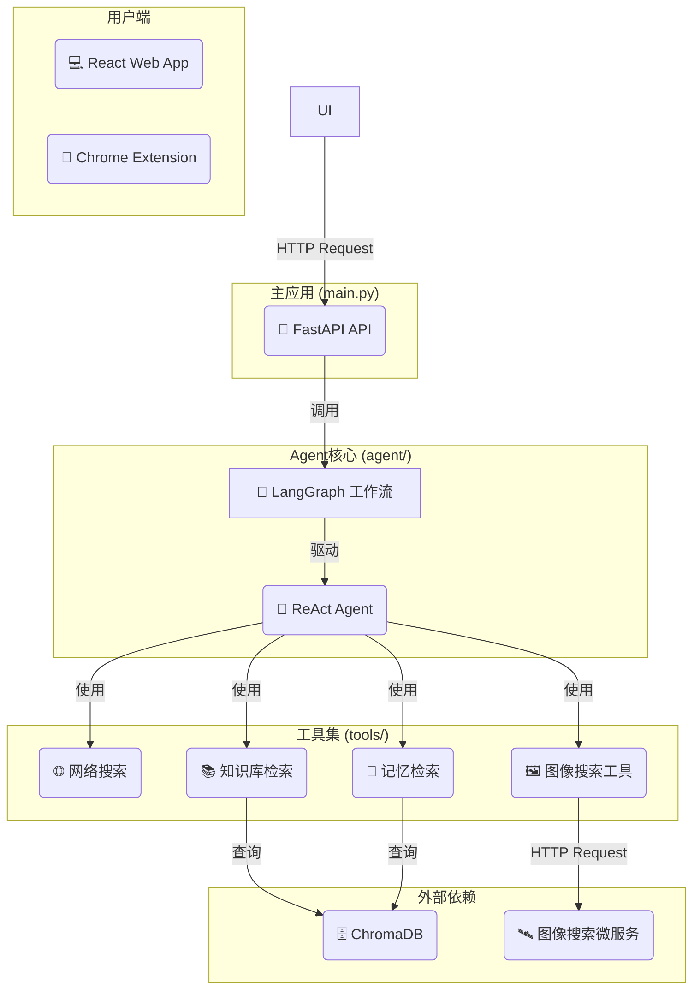

# 🎓 AI 学生费曼学习系统 (V3)

一个基于 **LangGraph** 和 **FastAPI** 的高级 AI Agent，它扮演“AI 学生”的角色，通过费曼学习法帮助用户巩固和深化知识。

## 🌟 项目特色

- **🤖 ReAct Agent 核心**: 使用能够**思考**和**行动**的智能体，而不仅仅是问答。
- **🛠️ 可扩展工具集**: Agent 可以使用多种工具来辅助分析：
  - **网络搜索**: 验证信息，获取最新知识 (Tavily)。
  - **图像搜索**: 进行多模态的图片检索 (SerpApi)。
  - **知识库检索 (RAG)**: 从您提供的本地文档中检索相关信息。
  - **长期记忆**: 回忆过去的对话，实现上下文关联。
- **🚀 微服务架构**: 主要功能（如图像搜索）被构建为独立的 FastAPI 服务，易于维护和扩展。
- **🧠 长期与短期记忆**: 区分会话内的短期记忆和跨会话的长期记忆（存储于 ChromaDB）。
- **🖥️ 交互式 Web 界面**: 提供基于 Streamlit 的友好界面，方便与 Agent 进行对话。
- **✅ 异步处理**: 基于 FastAPI 和 LangGraph 的异步能力，实现高效的请求处理。

## 🏗️ 技术架构

- **核心框架**: LangGraph, LangChain
- **后端服务**: FastAPI
- **前端应用**: React (Vite)
- **Chrome 插件**: Manifest V3
- **向量数据库**: ChromaDB
- **工具 API**: Tavily (网络搜索), SerpApi (图像搜索)

### 系统架构图



## 🚀 快速开始

### 1. 环境与依赖

- **后端**: 推荐使用 Python 3.9+和虚拟环境。
- **前端**: Node.js v20+, pnpm v10+。
- **安装依赖**:

  ```~~bash~~
  pip install -r requirements.txt

  # 安装前端依赖
  cd frontend
  pnpm install
  cd ..
  ```

### 2. 配置环境变量

- 复制配置文件模板：
  ```bash
  cp .env.example .env
  ```
- 编辑 `.env` 文件，填入你的 API 密钥。至少需要 `OPENAI_API_KEY`。

  ```dotenv
  # LangChain/LangSmith (可选, 用于调试)
  LANGCHAIN_TRACING_V2="true"
  LANGCHAIN_API_KEY="..."

  # OpenAI API (必需)
  OPENAI_API_KEY="..."

  # 工具API (可选, 但强烈推荐)
  TAVILY_API_KEY="..."   # 用于网络搜索
  SERPAPI_API_KEY="..."    # 用于图像搜索
  ```

### 3. 构建本地知识库 (可选)

如果你希望 Agent 能查询你本地的文档（PDF, TXT, DOCX 等），请执行此步骤。

- 将你的文档文件放入 `/data` 目录下。
- 运行数据注入脚本，为每个文件构建知识库：

  ```bash
  # 示例: 处理 data/sample_knowledge.txt 文件
  python ingest.py sample_knowledge.txt

  # 示例: 处理 data/my_document.pdf 文件
  python ingest.py my_document.pdf
  ```

### 4. 启动所有服务

你需要打开 **3 个** 独立的终端来分别启动所有服务。

- **终端 1: 启动图像搜索微服务**

  ```bash
  uvicorn mcp_servers.image_search_server.main:app --reload --port 8001
  ```

- **终端 2: 启动主应用 API**

  ```bash
  uvicorn main:app --reload --port 8000
  ```

  > 📝 **注意**: 如果在启动时遇到与 `protobuf` 相关的错误，请尝试使用以下命令启动：
  >
  > ```bash
  > export PROTOCOL_BUFFERS_PYTHON_IMPLEMENTATION=python && uvicorn main:app --reload --port 8000
  > ```

- **终端 3: 启动前端开发服务器 (React)**
  ```bash
  cd frontend
  pnpm dev
  ```

### 5. 开始使用

- 在浏览器中打开 Streamlit 界面给出的地址 (通常是 `http://localhost:8501`)。
- 在侧边栏设定一个学习主题，然后在主聊天窗口开始向 AI 学生传授知识！

## 📖 API 使用

应用后端是一个标准的 FastAPI 服务。你可以在服务启动后，访问 `http://localhost:8000/docs` 查看并测试 API 接口。

- **核心端点**: `POST /chat`
- **请求体**:
  ```json
  {
    "topic": "string",
    "explanation": "string",
    "session_id": "string",
    "short_term_memory": [
      {
        "role": "string",
        "content": "string"
      }
    ]
  }
  ```

## 🔧 开发与测试

### 扩展工具

若要添加新工具，请在 `agent/tools.py` 中定义它，然后在 `agent/agent.py` 中将其添加到 `tools` 列表中。

### 运行测试 (待实现)

我们计划使用 `pytest` 进行测试。

```bash
pytest
```

---

**通过向 AI 学生教授来真正掌握知识！** 🚀
