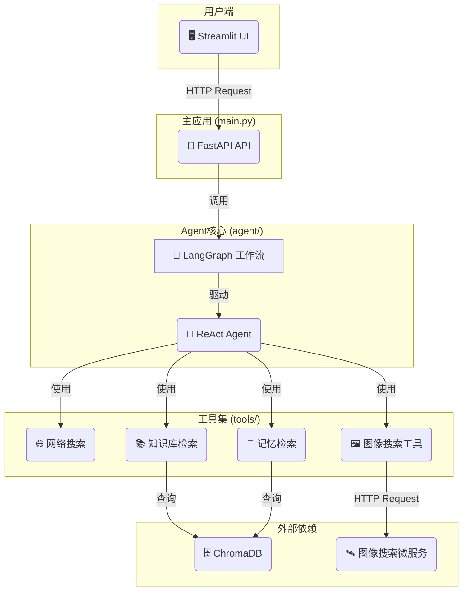

# 🎓 AI学生费曼学习系统 (V3)

一个基于 **LangGraph** 和 **FastAPI** 的高级AI Agent，它扮演"AI学生"的角色，通过费曼学习法帮助用户巩固和深化知识。

> **最新更新**: 系统已完成重构，采用模块化架构，支持多种工具集成和异步处理。

## 🌟 项目特色

- **🤖 ReAct Agent核心**: 使用能够**思考**和**行动**的智能体，而不仅仅是问答。
- **🚀 流式响应**: Agent的回答以打字机效果实时显示，提升了交互的即时感和用户体验。
- **🛠️ 可扩展工具集**: Agent可以使用多种工具来辅助分析：
    - **网络搜索**: 验证信息，获取最新知识 (Tavily)。
    - **图像搜索**: 进行多模态的图片检索 (SerpApi)。
    - **知识库检索 (RAG)**: 从您提供的本地文档中检索相关信息。
    - **长期记忆**: 回忆过去的对话，实现上下文关联。
- **🚀 微服务架构**: 主要功能（如图像搜索）被构建为独立的FastAPI服务，易于维护和扩展。
- **🧠 长期与短期记忆**: 区分会话内的短期记忆和跨会话的长期记忆（存储于ChromaDB）。
- **🖥️ 交互式Web界面**: 提供基于Streamlit的友好界面，方便与Agent进行对话。
- **✅ 异步处理**: 基于FastAPI和LangGraph的异步能力，实现高效的请求处理。

## 🏗️ 技术架构

- **核心框架**: LangGraph, LangChain
- **后端服务**: FastAPI
- **Web界面**: Streamlit
- **向量数据库**: ChromaDB
- **工具API**: Tavily (网络搜索), SerpApi (图像搜索)

### 系统架构图



## 🚀 快速开始

### 1. 环境与依赖

- 推荐使用 Python 3.9。
- 安装依赖有两种方式：

  **方式 A：使用 uv（推荐）**
  ```bash
  # 安装 uv（一次性操作）
  brew install uv  # macOS 用户
  # 或
  curl -LsSf https://astral.sh/uv/install.sh | sh

  # 同步依赖并自动创建虚拟环境
  uv sync
  ```

  **方式 B：使用 pip**
  ```bash
  python -m venv .venv
  source .venv/bin/activate  # Windows 用户执行 .venv\\Scripts\\activate
  pip install -r requirements.txt
  ```

### 2. 配置环境变量 ✨

#### 快速配置 (推荐)
```bash
# 一键设置开发环境
make quickstart

# 交互式配置向导
make config-setup

# 验证配置
make config-check
```

#### 手动配置
```bash
# 复制配置模板
cp env_template .env

# 编辑配置文件
nano .env

# 或创建特定环境配置
make config-dev    # 开发环境
make config-prod   # 生产环境
make config-minimal # 最小配置
```

#### 配置验证
```bash
# API验问检查
curl http://localhost:8005/config/validation

# 命令行验证
python scripts/config_validator.py --show-guide
```
- 在根目录的 `.env` 文件中设置关键配置项：
  ```dotenv
  # OpenAI API (必需)
  OPENAI_API_KEY=your-openai-api-key-here
  OPENAI_MODEL=gpt-4o
  OPENAI_TEMPERATURE=0.7

  # 工具API (可选, 但强烈推荐)
  TAVILY_API_KEY=your-tavily-api-key-here   # 用于网络搜索

  # 开发配置
  DEBUG=true
  ENVIRONMENT=development
  ```

### 3. 构建本地知识库 (可选)

如果你希望Agent能查询你本地的文档（PDF, TXT, DOCX等），请执行此步骤。

- 将你的文档文件放入 `/data` 目录下。
- 运行数据注入脚本，为每个文件构建知识库：
  ```bash
  # 示例: 处理 data/sample_knowledge.txt 文件
  python ingest.py sample_knowledge.txt
  
  # 示例: 处理 data/my_document.pdf 文件
  python ingest.py my_document.pdf
  ```

### 4. 部署到服务器

项目已配置为支持完整服务器部署，包含nginx反向代理和systemd服务管理。

#### 快速部署
```bash
# 1. 同步依赖
uv sync

# 2. 启动所有服务
sudo ./scripts/development/deploy_feynman_app.sh start

# 3. 部署nginx配置
sudo ./scripts/development/deploy_feynman_app.sh nginx

# 4. 检查服务状态
./scripts/development/deploy_feynman_app.sh status
```

#### 手动启动（开发环境）

你需要打开 **2个** 独立的终端来分别启动所有服务。

- **终端 1: 启动主应用API**
  ```bash
  # 使用 uv
  uv run uvicorn main:app --reload --port 8005
  # 使用 pip（需先激活虚拟环境）
  uvicorn main:app --reload --port 8005
  ```

- **终端 2: 启动Streamlit Web界面**
  ```bash
  # 使用 uv
  uv run streamlit run src/feynman/interfaces/web/streamlit_ui.py --server.port 8501
  # 使用 pip（需先激活虚拟环境）
  streamlit run src/feynman/interfaces/web/streamlit_ui.py --server.port 8501
  ```

> **提示**: 建议使用虚拟环境来管理Python依赖，避免版本冲突。

### 5. 开始使用

#### 服务器部署访问
- **域名访问**: `http://feynmanlearning.wiki`
- **API文档**: `http://localhost:8005/docs` (服务器内部访问)

#### 开发环境访问
- 在浏览器中打开Streamlit界面给出的地址 (通常是 `http://localhost:8501`)。
- 在侧边栏设定一个学习主题，然后在主聊天窗口开始向AI学生传授知识！

#### 服务管理
```bash
# 检查服务状态
./scripts/development/deploy_feynman_app.sh status

# 停止服务
sudo ./scripts/development/deploy_feynman_app.sh stop

# 重启服务
sudo ./scripts/development/deploy_feynman_app.sh restart
```

## 📖 API 使用

应用后端是一个标准的FastAPI服务。你可以在服务启动后，访问 `http://localhost:8005/docs` 查看并测试API接口。

- **核心端点**: 
  - `POST /chat/stream`: (推荐) 与Agent进行流式对话。
  - `POST /memorize`: (内部) 异步固化对话记忆。
  - `POST /chat`: (旧版) 一次性返回完整响应。
- **请求体 (`/chat/stream`)**:
  ```json
  {
    "topic": "string",
    "explanation": "string",
    "session_id": "string",
    "short_term_memory": [
      {
        "role": "string",
        "content": "string"
      }
    ]
  }
  ```

## 🔧 开发与测试

### 扩展工具

若要添加新工具，请在 `agent/tools.py` 中定义它，然后在 `agent/agent.py` 中将其添加到 `tools` 列表中。

### 运行测试

系统包含单元测试和集成测试：
```bash
# 使用 uv
uv run pytest
uv run pytest tests/test_api.py
uv run pytest tests/integration/

# 使用 pip
pytest
pytest tests/test_api.py
pytest tests/integration/
```

## 🛠️ 故障排除

### 常见问题

1. **端口冲突**
   - 确保端口 8005,8501 未被占用
   - 可以修改启动命令中的端口号

2. **API密钥问题**
   - 确保 `environments/test.env` 中的 OpenAI API 密钥有效
   - 检查网络连接和API配额

3. **依赖安装问题**
   - 使用虚拟环境避免依赖冲突
   - 确保Python版本为3.9+

4. **服务启动失败**
   - 检查日志输出中的错误信息
   - 确保所有必需的环境变量已设置

### 获取帮助

- 查看 `logs/` 目录中的日志文件
- 检查 FastAPI 自动生成的文档: `http://localhost:8005/docs`
- 提交 GitHub Issues 报告问题

## 📁 项目结构说明

```
ai_student_agent/
├── src/                          # 源码根目录
│   ├── feynman/                  # 主要应用包
│   │   ├── agents/               # AI代理核心逻辑
│   │   │   ├── core/             # 代理核心实现
│   │   │   ├── parsers/          # 响应解析器
│   │   │   └── tools/            # 工具集成
│   │   ├── api/                  # API路由和处理器
│   │   ├── core/                 # 核心组件
│   │   │   ├── config/           # 配置管理
│   │   │   └── graph/            # LangGraph工作流
│   │   ├── infrastructure/       # 基础设施层
│   │   ├── interfaces/           # 接口层
│   │   │   └── web/              # Web接口实现
│   │   └── tasks/                # 异步任务处理
│   └── main.py                   # FastAPI应用入口
├── config/                       # 配置目录
│   ├── alerting_rules.yml        # Prometheus告警规则
│   ├── alertmanager.yml          # Alertmanager配置
│   ├── blackbox.yml              # 黑盒监控配置
│   ├── docker-compose.monitoring.yml # 监控栈配置
│   ├── grafana/                  # Grafana仪表板配置
│   ├── nginx/                    # Nginx反向代理配置
│   └── prometheus.yml            # Prometheus配置
├── scripts/                      # 部署和管理脚本
│   ├── development/              # 开发环境脚本
│   │   └── deploy_feynman_app.sh # 完整部署脚本
│   ├── setup/                    # 环境设置脚本
│   └── monitoring/               # 监控相关脚本
├── webapp/                       # 前端Web应用
│   ├── src/                      # 前端源码
│   ├── package.json              # Node.js依赖
│   ├── vite.config.ts            # Vite构建配置
│   └── index.html                # 应用入口
├── docs/                         # 项目文档
│   ├── architecture_refactoring_summary.md
│   ├── multi_agent_system_implementation_summary.md
│   └── project_structure.md      # 项目结构详细说明
├── examples/                     # 示例代码和演示
│   ├── advanced/                 # 高级用法示例
│   ├── knowledge_graph_demo.py   # 知识图谱演示
│   └── simple_kg_test.py         # 简单知识图谱测试
├── storage/                      # 持久化存储
│   └── logs/                     # 结构化日志存储
├── chroma_db/                    # ChromaDB向量数据库
├── data/                         # 知识库数据文件
├── logs/                         # 应用运行日志
├── tests/                        # 测试代码
│   └── integration/              # 集成测试
├── pyproject.toml                # Python项目配置
├── uv.lock                       # 依赖版本锁定
├── env_template                  # 环境变量配置模板
└── README.md                     # 项目文档
```

## 📋 版本信息

### 当前版本: V3.2
- ✅ 基于 LangGraph 的 ReAct Agent 架构
- ✅ 支持多种工具集成（网络搜索、翻译、数学计算、学术检索等）
- ✅ 流式响应与打字机UI效果
- ✅ 记忆固化移至后台任务，API响应更快
- ✅ 长短期记忆管理
- ✅ 异步 FastAPI 后端
- ✅ Streamlit Web 界面
- ✅ **服务器部署支持**
  - nginx反向代理配置
  - systemd服务管理
  - 域名访问支持 (feynmanlearning.wiki)
  - WebSocket连接优化
- ✅ 完整的监控与追踪系统
  - OpenTelemetry 分布式追踪
  - Prometheus 指标收集
  - 结构化日志记录
  - LLM 成本追踪和预算控制
  - 健康检查和告警系统
  - Grafana 可视化面板

### 主要依赖
- **Python**: 3.9+
- **LangChain**: 最新版本
- **LangGraph**: 工作流引擎
- **FastAPI**: Web 框架
- **Streamlit**: 前端界面
- **ChromaDB**: 向量数据库
- **OpenAI**: GPT 模型

### 更新日志
- **V3.0**: 完全重构，采用 LangGraph 架构，新增流式输出, 优化UI渲染, 改进启动流程, 增加后台记忆任务
- **V2.x**: 多智能体系统（已废弃）
- **V1.x**: 基础费曼学习实现（已废弃）

---

**通过向AI学生教授来真正掌握知识！** 🚀

*基于费曼学习法的原理：教授他人是最好的学习方式。* 