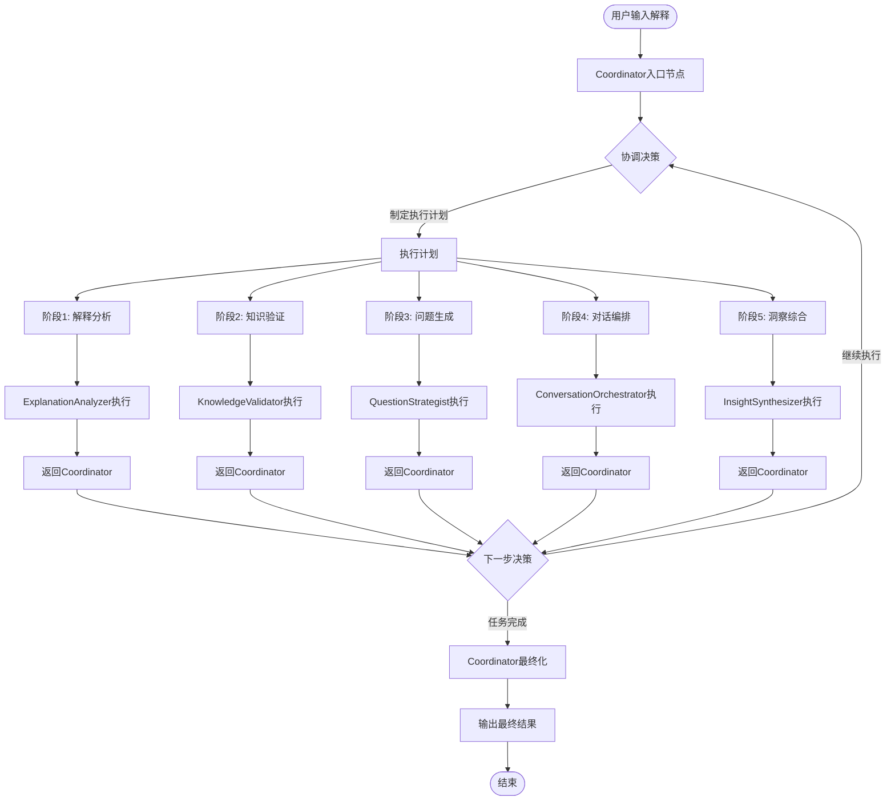
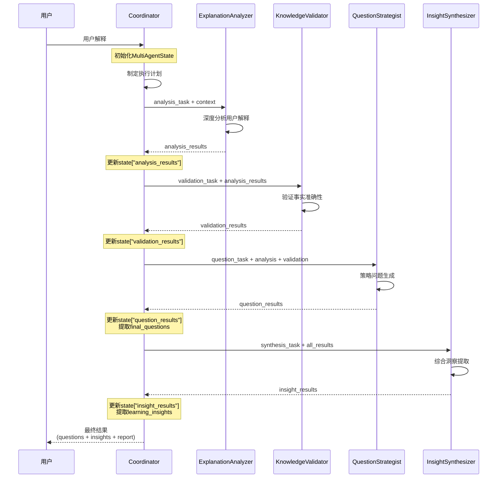

# Agent协作机制详细说明

## 🎯 概述

费曼学习系统的多Agent协作采用**中央协调 + 专业分工**的架构模式，通过Coordinator Agent统筹指挥，各专业Agent协同工作，实现智能化的学习分析和问题生成。

## 🔄 协作流程

### 1. 整体协作流程图



### 2. 详细协作步骤

#### 🎯 步骤1：协调者入口 (Coordinator Entry)

```python
async def _coordinator_entry_node(self, state: MultiAgentState) -> MultiAgentState:
    # 1. 分析当前状态和需求
    context = ConversationContext(
        session_id=state["session_id"],
        topic=state["topic"], 
        user_explanation=state["user_explanation"],
        conversation_history=state.get("short_term_memory", [])
    )
    
    # 2. 创建协调任务
    coordination_task = create_task(
        task_type="global_coordination",
        input_data={
            "current_state": state,
            "system_status": self.registry.get_system_statistics(),
            "requirements": {"quality": "high", "urgency": "medium"}
        }
    )
    
    # 3. 制定执行决策
    coordinator = self.agents[AgentType.COORDINATOR]
    response = await coordinator.process_task(coordination_task, context)
    
    # 4. 更新状态和决策
    if response.success:
        decision = response.result.get("coordination_decision", {})
        state["coordinator_decision"] = decision
        state["current_phase"] = decision.get("next_phase", "analysis")
    
    return state
```

**协调者的决策逻辑**：
- 分析任务复杂度和用户需求
- 评估系统资源和Agent状态
- 选择最优的执行策略（顺序、并行、流水线、自适应）
- 决定下一个执行的Agent和任务优先级

#### 📝 步骤2：解释分析 (ExplanationAnalyzer)

```python
async def _explanation_analysis_node(self, state: MultiAgentState) -> MultiAgentState:
    # 1. 构建分析任务
    analysis_task = create_task(
        task_type="explanation_analysis",
        input_data={
            "explanation": state["user_explanation"],
            "topic": state["topic"]
        }
    )
    
    # 2. 执行深度分析
    analyzer = self.agents[AgentType.EXPLANATION_ANALYZER]
    response = await analyzer.process_task(analysis_task, context)
    
    # 3. 处理分析结果
    if response.success:
        state["analysis_results"] = response.result
        state["completed_tasks"].append("explanation_analysis")
        
        # 记录分析指标
        add_span_event("explanation_analysis_completed", {
            "unclear_points_count": len(response.result.get("unclear_points", [])),
            "is_complete": response.result.get("is_complete", False)
        })
    
    return state
```

**ExplanationAnalyzer的工作内容**：
- 使用LLM深度理解用户解释
- 识别逻辑跳跃、模糊概念、定义不准确的地方
- 评估理解质量和知识深度
- 输出结构化的疑点分析结果

#### ✅ 步骤3：知识验证 (KnowledgeValidator)

```python
async def _knowledge_validation_node(self, state: MultiAgentState) -> MultiAgentState:
    # 1. 基于分析结果创建验证任务
    validation_task = create_task(
        task_type="knowledge_validation",
        input_data={
            "explanation": state["user_explanation"],
            "analysis_results": state.get("analysis_results", {})
        }
    )
    
    # 2. 执行事实验证
    validator = self.agents[AgentType.KNOWLEDGE_VALIDATOR]
    response = await validator.process_task(validation_task, context)
    
    # 3. 整合验证结果
    if response.success:
        state["validation_results"] = response.result
        state["completed_tasks"].append("knowledge_validation")
    
    return state
```

**KnowledgeValidator的工作内容**：
- 验证解释中的事实准确性
- 识别常见误解和错误概念
- 使用工具（Web搜索、知识库）查证信息
- 生成验证报告和准确性评分

#### 🎯 步骤4：问题生成 (QuestionStrategist)

```python
async def _question_generation_node(self, state: MultiAgentState) -> MultiAgentState:
    # 1. 整合前面的分析和验证结果
    question_task = create_task(
        task_type="question_generation",
        input_data={
            "unclear_points": state.get("analysis_results", {}).get("unclear_points", []),
            "validation_results": state.get("validation_results", {}),
            "learner_level": "intermediate"
        }
    )
    
    # 2. 策略性问题设计
    strategist = self.agents[AgentType.QUESTION_STRATEGIST]
    response = await strategist.process_task(question_task, context)
    
    # 3. 提取最终问题
    if response.success:
        state["question_results"] = response.result
        state["completed_tasks"].append("question_generation")
        
        # 提取问题列表
        question_set = response.result.get("question_set", {})
        primary_questions = question_set.get("primary_questions", [])
        state["final_questions"] = [q.get("content", "") for q in primary_questions]
    
    return state
```

**QuestionStrategist的工作内容**：
- 基于疑点分析设计针对性问题
- 调整问题难度和深度
- 选择最佳提问策略（概念澄清、逻辑推理、应用场景等）
- 生成结构化的问题集合

#### 🎭 步骤5：对话编排 (ConversationOrchestrator)

```python
async def _conversation_orchestration_node(self, state: MultiAgentState) -> MultiAgentState:
    # 1. 分析当前对话状态
    orchestration_task = create_task(
        task_type="workflow_orchestration",
        input_data={
            "current_state": state,
            "available_results": {
                "analysis": state.get("analysis_results", {}),
                "validation": state.get("validation_results", {}),
                "questions": state.get("question_results", {})
            }
        }
    )
    
    # 2. 制定对话编排策略
    orchestrator = self.agents[AgentType.CONVERSATION_ORCHESTRATOR]
    response = await orchestrator.process_task(orchestration_task, context)
    
    # 3. 应用编排决策
    if response.success:
        state["orchestration_results"] = response.result
        state["completed_tasks"].append("conversation_orchestration")
    
    return state
```

**ConversationOrchestrator的工作内容**：
- 分析学习进度和对话历史
- 决定何时深入、何时转换话题
- 控制学习节奏和难度递进
- 提供对话流程优化建议

#### 💡 步骤6：洞察综合 (InsightSynthesizer)

```python
async def _insight_synthesis_node(self, state: MultiAgentState) -> MultiAgentState:
    # 1. 综合所有Agent的结果
    synthesis_task = create_task(
        task_type="insight_synthesis",
        input_data={
            "all_results": {
                "analysis": state.get("analysis_results", {}),
                "validation": state.get("validation_results", {}),
                "questions": state.get("question_results", {}),
                "orchestration": state.get("orchestration_results", {})
            }
        }
    )
    
    # 2. 提取学习洞察
    synthesizer = self.agents[AgentType.INSIGHT_SYNTHESIZER]
    response = await synthesizer.process_task(synthesis_task, context)
    
    # 3. 生成学习报告
    if response.success:
        state["insight_results"] = response.result
        state["completed_tasks"].append("insight_synthesis")
        
        # 提取洞察内容
        insights = response.result.get("insights", [])
        state["learning_insights"] = [insight.get("content", "") for insight in insights]
    
    return state
```

**InsightSynthesizer的工作内容**：
- 综合分析所有Agent的输出结果
- 提取关键学习洞察和知识连接
- 评估学习效果和进度
- 生成个性化的学习报告

#### 🏁 步骤7：协调者最终化

```python
async def _coordinator_finalization_node(self, state: MultiAgentState) -> MultiAgentState:
    # 1. 生成最终学习报告
    finalization_task = create_task(
        task_type="report_generation",
        input_data={
            "session_summary": {
                "completed_tasks": state["completed_tasks"],
                "final_questions": state["final_questions"],
                "learning_insights": state["learning_insights"],
                "error_log": state["error_log"]
            }
        }
    )
    
    # 2. 整合最终结果
    synthesizer = self.agents[AgentType.INSIGHT_SYNTHESIZER]
    response = await synthesizer.process_task(finalization_task, context)
    
    if response.success:
        state["learning_report"] = response.result.get("learning_report", {})
    
    # 3. 标记完成状态
    state["current_phase"] = "completed"
    
    return state
```

## 🧠 智能路由机制

### 动态路由决策

```python
def _route_next_step(self, state: MultiAgentState) -> str:
    """智能路由决策逻辑"""
    decision = state.get("coordinator_decision", {})
    current_phase = state.get("current_phase", "")
    completed_tasks = state.get("completed_tasks", [])
    
    # 1. 检查必要任务完成情况
    required_tasks = ["explanation_analysis", "question_generation"]
    all_required_completed = all(task in completed_tasks for task in required_tasks)
    
    # 2. 根据完成状态决定路由
    if all_required_completed and current_phase == "completed":
        return "end"
    
    # 3. 根据协调者决策选择下一步
    next_phase = decision.get("next_phase", "explanation_analysis")
    
    # 4. 智能路由映射
    route_mapping = {
        "explanation_analysis": "explanation_analysis",
        "knowledge_validation": "knowledge_validation", 
        "question_generation": "question_generation",
        "conversation_orchestration": "conversation_orchestration",
        "insight_synthesis": "insight_synthesis",
        "finalization": "finalization"
    }
    
    # 5. 检查任务是否已完成，避免重复执行
    if next_phase in route_mapping and next_phase not in completed_tasks:
        return route_mapping[next_phase]
    
    # 6. 默认进入最终化
    return "finalization"
```

## 📊 Agent间数据流

### 状态数据结构

```python
class MultiAgentState(TypedDict):
    # 基础信息
    session_id: str                          # 会话ID
    topic: str                              # 学习主题
    user_explanation: str                   # 用户解释
    
    # 工作流控制
    workflow_id: str                        # 工作流ID
    current_phase: str                      # 当前阶段
    coordinator_decision: Optional[Dict]     # 协调决策
    
    # Agent执行结果
    analysis_results: Dict[str, Any]        # 解释分析结果
    validation_results: Dict[str, Any]      # 知识验证结果  
    question_results: Dict[str, Any]        # 问题生成结果
    orchestration_results: Dict[str, Any]   # 对话编排结果
    insight_results: Dict[str, Any]         # 洞察综合结果
    
    # 最终输出
    final_questions: List[str]              # 最终问题列表
    learning_insights: List[str]            # 学习洞察
    learning_report: Optional[Dict]         # 学习报告
    
    # 系统状态
    active_agents: List[str]                # 活跃Agent列表
    completed_tasks: List[str]              # 已完成任务
    error_log: List[Dict[str, Any]]        # 错误日志
```

### 数据传递流程



## 🔧 协作机制特点

### 1. 中央协调模式
- **统一指挥**: Coordinator作为中央大脑统筹全局
- **智能调度**: 根据任务特点动态选择执行策略
- **资源优化**: 合理分配Agent资源，避免冲突

### 2. 专业化分工
- **术业专攻**: 每个Agent专注自己的领域
- **深度优化**: 针对特定任务优化算法和提示词
- **质量保证**: 专业化带来更高的输出质量

### 3. 状态共享机制
- **统一状态**: 所有Agent共享MultiAgentState
- **增量更新**: 每个Agent更新自己负责的状态部分
- **历史追踪**: 完整记录执行历史和决策过程

### 4. 容错与降级
- **错误隔离**: 单个Agent失败不影响整体流程
- **自动降级**: 关键Agent失败时启用备用方案
- **状态恢复**: 支持从任意节点恢复执行

### 5. 可观测性
- **全链路追踪**: 记录每个Agent的执行过程
- **性能监控**: 实时监控Agent性能和资源使用
- **调试支持**: 详细的日志和状态信息

## 🎯 协作优势

### 1. 智能化提升
- **深度理解**: 专业Agent深入分析各个维度
- **精准决策**: 基于多维信息的智能决策
- **个性化**: 根据用户特点调整协作策略

### 2. 性能优化
- **并行处理**: 支持Agent并行执行提高效率
- **资源复用**: 智能复用计算结果和缓存
- **负载均衡**: 动态调整Agent负载

### 3. 可扩展性
- **模块化**: 新Agent可独立开发和集成
- **插件化**: 支持动态加载和卸载Agent
- **标准化**: 统一的接口和通信协议

### 4. 可维护性
- **清晰职责**: 每个Agent职责明确，易于维护
- **独立部署**: 支持Agent独立部署和更新
- **版本管理**: 支持Agent版本控制和回滚

这种多Agent协作机制不仅实现了复杂任务的智能分解和执行，还保证了系统的高性能、高可用和高扩展性，为费曼学习系统提供了强大的技术支撑。

