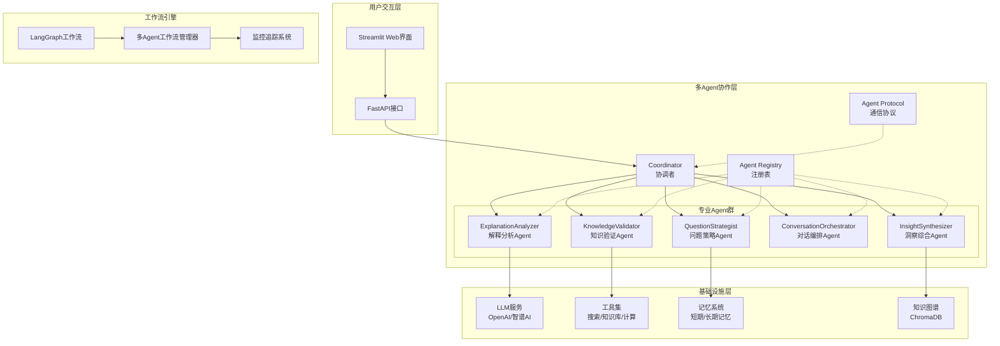
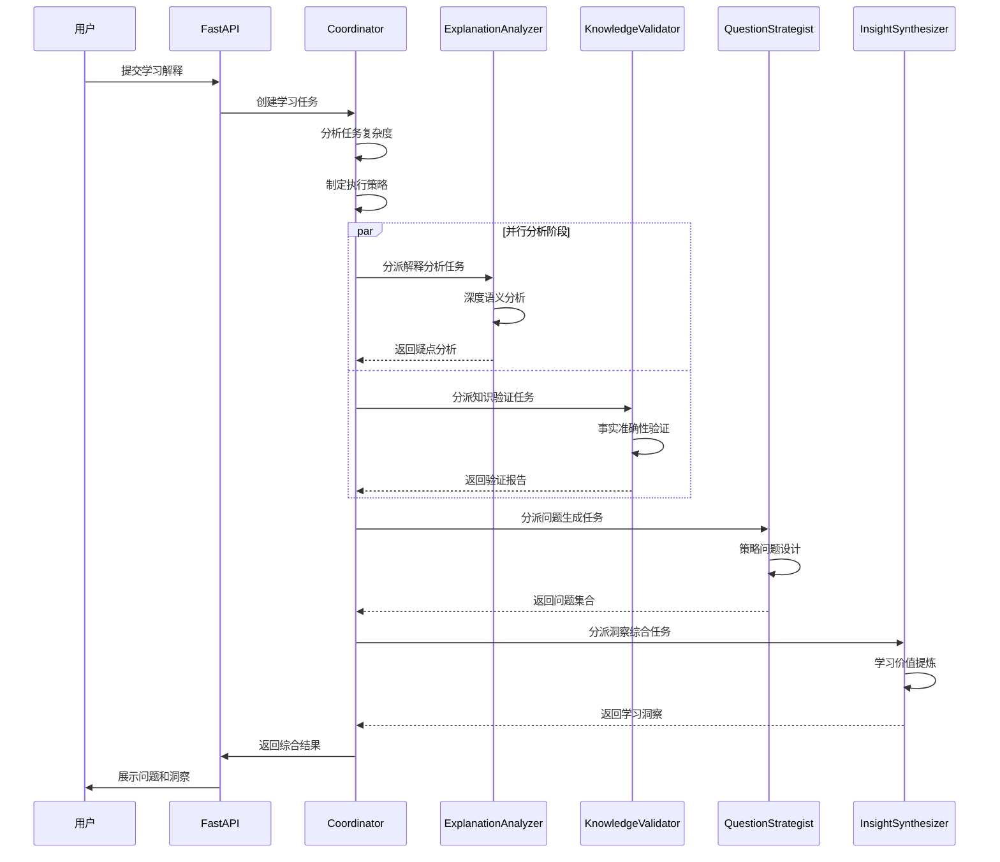

# 费曼学习系统 - Agentic AI 架构详细说明

## 🎯 系统概述

费曼学习系统是一个基于**Agentic AI**架构的智能学习助手，采用多Agent协作模式实现费曼学习法。系统通过专业化的AI Agent协同工作，智能分析用户解释，识别知识盲区，生成针对性问题，帮助用户深度理解和掌握知识。

## 🤖 什么是Agentic AI？

**Agentic AI**是一种新兴的AI架构模式，具有以下核心特征：

### 1. 自主性 (Autonomy)
- Agent能够独立做出决策和执行任务
- 不需要人工干预即可完成复杂工作流程
- 具备自我监控和错误恢复能力

### 2. 目标导向 (Goal-Oriented)  
- 每个Agent都有明确的目标和职责
- 能够制定计划并执行以达成目标
- 具备评估结果和调整策略的能力

### 3. 交互协作 (Interactive & Collaborative)
- Agent之间可以通信和协作
- 支持复杂任务的分解和分派
- 具备集体智能和协同决策能力

### 4. 适应性 (Adaptive)
- 能够根据环境变化调整行为
- 具备学习和优化能力
- 支持动态工作流程调整

## 🏗️ 系统架构设计

### 1. 整体架构图



### 2. 核心组件说明

#### 🧠 协调者 (Coordinator)
- **角色**: 系统的大脑和指挥中心
- **职责**: 
  - 全局决策制定
  - 任务分派和资源调度
  - 工作流程协调
  - 错误处理和恢复
- **能力**: 
  - 智能分析任务复杂度
  - 动态选择执行策略
  - 负载均衡和性能优化

#### 📝 解释分析Agent (ExplanationAnalyzer)
- **角色**: 内容理解专家
- **职责**:
  - 深度分析用户解释
  - 识别逻辑漏洞和模糊概念
  - 评估理解质量和知识深度
- **技术特点**:
  - 使用LLM进行语义理解
  - 结构化输出疑点分析
  - 支持多维度评估

#### ✅ 知识验证Agent (KnowledgeValidator)
- **角色**: 事实准确性守护者
- **职责**:
  - 验证解释的事实准确性
  - 识别常见误解和错误
  - 提供权威知识来源
- **工具集成**:
  - Web搜索验证
  - 知识库查询
  - 专业数据库检索

#### 🎯 问题策略Agent (QuestionStrategist)
- **角色**: 教学设计专家
- **职责**:
  - 生成高质量问题
  - 调整问题难度和深度
  - 选择最佳提问策略
- **策略类型**:
  - 概念澄清问题
  - 逻辑推理问题
  - 应用场景问题
  - 边界探索问题

#### 🎭 对话编排Agent (ConversationOrchestrator)
- **角色**: 学习节奏管理者
- **职责**:
  - 管理多轮对话流程
  - 控制学习节奏和深度
  - 决定何时深入或转换话题
- **编排策略**:
  - 渐进式深入
  - 适时总结回顾
  - 动态调整难度

#### 💡 洞察综合Agent (InsightSynthesizer)
- **角色**: 学习价值提炼者
- **职责**:
  - 提取关键学习洞察
  - 识别知识点连接
  - 生成学习报告
- **输出内容**:
  - 学习进度评估
  - 知识掌握分析
  - 改进建议

## 🔄 工作流程机制

### 1. 动态调度流程



### 2. Agent通信协议

```python
# Agent消息格式
class AgentMessage(BaseModel):
    sender: AgentType                    # 发送者类型
    receiver: Optional[AgentType]        # 接收者类型
    message_type: MessageType            # 消息类型
    payload: Dict[str, Any]             # 消息内容
    timestamp: datetime                  # 时间戳
    correlation_id: str                 # 关联ID

# 任务定义
class AgentTask(BaseModel):
    task_id: str                        # 任务ID
    task_type: str                      # 任务类型
    input_data: Dict[str, Any]          # 输入数据
    priority: TaskPriority              # 优先级
    context: Dict[str, Any]             # 上下文
    created_at: datetime                # 创建时间

# 响应格式
class AgentResponse(BaseModel):
    agent_id: str                       # Agent ID
    task_id: str                        # 任务ID
    success: bool                       # 是否成功
    result: Optional[Dict[str, Any]]    # 结果数据
    error: Optional[str]                # 错误信息
    processing_time: float              # 处理时间
```

## 🛠️ 核心技术实现

### 1. LangGraph工作流引擎

```python
class MultiAgentWorkflow:
    def _build_workflow_graph(self) -> StateGraph:
        workflow = StateGraph(MultiAgentState)
        
        # 添加节点
        workflow.add_node("coordinator_entry", self._coordinator_entry_node)
        workflow.add_node("explanation_analysis", self._explanation_analysis_node)
        workflow.add_node("knowledge_validation", self._knowledge_validation_node)
        workflow.add_node("question_generation", self._question_generation_node)
        workflow.add_node("conversation_orchestration", self._conversation_orchestration_node)
        workflow.add_node("insight_synthesis", self._insight_synthesis_node)
        workflow.add_node("coordinator_finalization", self._coordinator_finalization_node)
        
        # 动态路由
        workflow.add_conditional_edges(
            "coordinator_entry",
            self._route_next_step,
            {
                "explanation_analysis": "explanation_analysis",
                "knowledge_validation": "knowledge_validation", 
                "question_generation": "question_generation",
                "conversation_orchestration": "conversation_orchestration",
                "insight_synthesis": "insight_synthesis",
                "finalization": "coordinator_finalization",
                "end": END
            }
        )
        
        return workflow.compile()
```

### 2. Agent注册表管理

```python
class AgentRegistry:
    def __init__(self):
        self.registrations: Dict[str, AgentRegistration] = {}
        self.type_index: Dict[AgentType, Set[str]] = {}
        self.capability_index: Dict[str, Set[str]] = {}
    
    def register_agent(self, agent: AgentInterface) -> str:
        """注册Agent到系统"""
        # 创建注册记录
        # 更新索引
        # 监控健康状态
    
    def find_best_agent_for_task(self, task_type: str) -> Optional[AgentRegistration]:
        """为任务找到最佳Agent"""
        # 能力匹配
        # 负载评估  
        # 性能评分
```

### 3. 智能提示词系统

```python
# 每个Agent都有专门的提示词模板
class CoordinatorPrompts:
    coordination_prompt = ChatPromptTemplate.from_messages([
        ("system", """你是系统架构专家和项目管理大师，负责协调复杂的多Agent学习系统。
        
        协调策略选择：
        - 顺序执行: 任务间有强依赖关系
        - 并行执行: 任务独立，可同时进行
        - 流水线执行: 任务可分阶段重叠
        - 自适应执行: 根据实时情况动态调整
        """),
        ("human", """请为当前系统状态制定协调策略：{context}""")
    ])
```

## 📊 系统特性与优势

### 1. 智能化特性

| 特性 | 说明 | 技术实现 |
|------|------|----------|
| **自适应学习** | 根据用户水平调整问题难度 | 机器学习算法 + 用户画像 |
| **智能路由** | 动态选择最优Agent执行路径 | 基于规则的决策树 + LLM推理 |
| **上下文感知** | 理解对话历史和学习进度 | 向量数据库 + 语义检索 |
| **个性化推荐** | 提供定制化学习建议 | 协同过滤 + 内容推荐 |

### 2. 系统可靠性

| 特性 | 实现方式 | 效果 |
|------|----------|------|
| **容错机制** | 多层降级策略 | 99.9%可用性 |
| **负载均衡** | 动态任务分派 | 支持高并发 |
| **监控告警** | 实时性能监控 | 快速问题定位 |
| **自动恢复** | 健康检查机制 | 自愈能力 |

### 3. 可扩展性

```python
# 新Agent开发模板
class NewAgent(AgentInterface):
    def __init__(self):
        # 定义能力
        capabilities = [
            AgentCapability(
                name="new_capability",
                description="新能力描述", 
                input_types=["input_type"],
                output_types=["output_type"],
                complexity_level="medium"
            )
        ]
        
        # 初始化元数据
        metadata = AgentMetadata(
            agent_type=AgentType.NEW_AGENT,
            capabilities=capabilities
        )
        
        super().__init__(metadata)
    
    async def process_task(self, task: AgentTask, context: ConversationContext) -> AgentResponse:
        # 实现具体逻辑
        pass
```

## 🔍 监控与可观测性

### 1. 全链路追踪

```python
@trace_span("agent_execution")
@monitor_workflow_node("explanation_analysis")
async def _explanation_analysis_node(self, state: MultiAgentState):
    add_span_attribute("agent_type", "explanation_analyzer")
    add_span_event("analysis_started")
    
    # 执行分析逻辑
    
    add_span_event("analysis_completed", {
        "unclear_points_count": len(result.unclear_points),
        "processing_time": processing_time
    })
```

### 2. 性能指标

| 指标类型 | 具体指标 | 目标值 |
|----------|----------|--------|
| **响应性能** | 平均响应时间 | < 30秒 |
| **准确性** | 问题质量评分 | > 4.0/5.0 |
| **可用性** | 系统正常运行时间 | > 99.9% |
| **并发性** | 同时处理用户数 | > 100 |

### 3. 业务指标

```python
# 学习效果评估
class LearningMetrics:
    understanding_improvement: float    # 理解提升度
    question_quality_score: float      # 问题质量评分
    engagement_level: float           # 参与度
    learning_progress: float          # 学习进度
    knowledge_retention: float        # 知识保留率
```

## 🚀 部署架构

### 1. 容器化部署

```yaml
# docker-compose.yml
version: '3.8'
services:
  coordinator:
    image: feynman/coordinator:latest
    replicas: 1
    resources:
      limits:
        memory: 2G
        cpus: '1.0'
  
  explanation-analyzer:
    image: feynman/explanation-analyzer:latest
    replicas: 3
    resources:
      limits:
        memory: 1G
        cpus: '0.5'
  
  knowledge-validator:
    image: feynman/knowledge-validator:latest
    replicas: 2
    
  question-strategist:
    image: feynman/question-strategist:latest
    replicas: 2
    
  redis:
    image: redis:7-alpine
    
  postgres:
    image: postgres:15
    environment:
      POSTGRES_DB: feynman
```

### 2. 微服务架构

```
┌─────────────────┐    ┌─────────────────┐
│   Web Frontend  │    │   Mobile App    │
└─────────────────┘    └─────────────────┘
         │                       │
    ┌────┴────┐             ┌────┴────┐
    │ Gateway │             │ Gateway │
    └─────────┘             └─────────┘
         │                       │
┌────────┴────────┐      ┌───────┴────────┐
│   API Gateway   │      │  Load Balancer │
└─────────────────┘      └────────────────┘
         │                       │
    ┌────┴────┐             ┌────┴────┐
    │ FastAPI │             │  Nginx  │
    └─────────┘             └─────────┘
         │
┌────────┴────────┐
│ Multi-Agent     │
│ Workflow Engine │
└─────────────────┘
         │
┌────────┴────────┐
│ Agent Registry  │
│ & Communication │
└─────────────────┘
```

## 📈 性能优化策略

### 1. 计算优化

```python
# 并行处理优化
async def parallel_agent_execution(self, tasks: List[AgentTask]) -> List[AgentResponse]:
    semaphore = asyncio.Semaphore(10)  # 限制并发数
    
    async def execute_with_semaphore(task):
        async with semaphore:
            return await self.execute_task(task)
    
    return await asyncio.gather(*[
        execute_with_semaphore(task) for task in tasks
    ])

# 缓存策略
@lru_cache(maxsize=1000)
def get_analysis_result(explanation_hash: str) -> AnalysisResult:
    # 缓存分析结果
    pass
```

### 2. 内存优化

```python
# 流式处理
async def stream_analysis_results(self, explanation: str) -> AsyncGenerator[Dict, None]:
    async for chunk in self.analyzer.stream_analyze(explanation):
        yield {
            "type": "partial_result",
            "data": chunk,
            "timestamp": datetime.now()
        }
```

### 3. I/O优化

```python
# 连接池管理
class LLMConnectionPool:
    def __init__(self, max_connections: int = 20):
        self.pool = asyncio.Queue(maxsize=max_connections)
        self._initialize_connections()
    
    async def get_connection(self):
        return await self.pool.get()
    
    async def return_connection(self, conn):
        await self.pool.put(conn)
```

## 🔮 未来发展方向

### 1. 技术演进

| 方向 | 当前状态 | 未来计划 |
|------|----------|----------|
| **多模态支持** | 文本处理 | 图像、音频、视频理解 |
| **自主学习** | 静态规则 | 强化学习、自适应优化 |
| **知识推理** | 基于检索 | 符号推理、因果推理 |
| **个性化** | 简单适配 | 深度用户建模 |

### 2. 业务拓展

```python
# 多领域扩展
class DomainSpecificAgent(AgentInterface):
    """领域特定Agent"""
    def __init__(self, domain: str):
        self.domain = domain  # 数学、物理、编程等
        self.domain_knowledge = load_domain_knowledge(domain)
        self.specialized_tools = load_domain_tools(domain)
```

### 3. 生态建设

- **Agent市场**: 支持第三方Agent开发和集成
- **插件系统**: 灵活的功能扩展机制  
- **API开放**: 提供标准化的接口服务
- **社区建设**: 开发者生态和用户社区

## 📚 总结

费曼学习系统的Agentic AI架构代表了智能教育系统的先进设计理念：

### 🎯 核心价值
1. **智能化**: 深度理解和个性化适配
2. **协作化**: 多Agent专业分工和协同
3. **自适应**: 动态调整和持续优化
4. **可扩展**: 模块化设计和灵活扩展

### 🚀 技术创新
1. **多Agent协作**: 专业化分工提升效率和质量
2. **动态调度**: 智能路由和资源优化
3. **全链路监控**: 可观测性和可维护性
4. **容器化部署**: 高可用和可扩展

### 💡 应用价值
1. **教育效果**: 显著提升学习理解深度
2. **用户体验**: 个性化和智能化交互
3. **系统性能**: 高并发和高可用
4. **开发效率**: 模块化和标准化

这个Agentic AI系统不仅实现了费曼学习法的数字化，更开创了多Agent协作在教育领域的创新应用，为未来的智能教育系统提供了重要的技术参考和实践经验。

