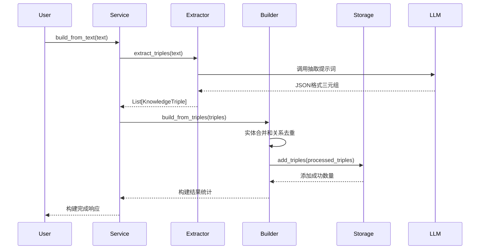
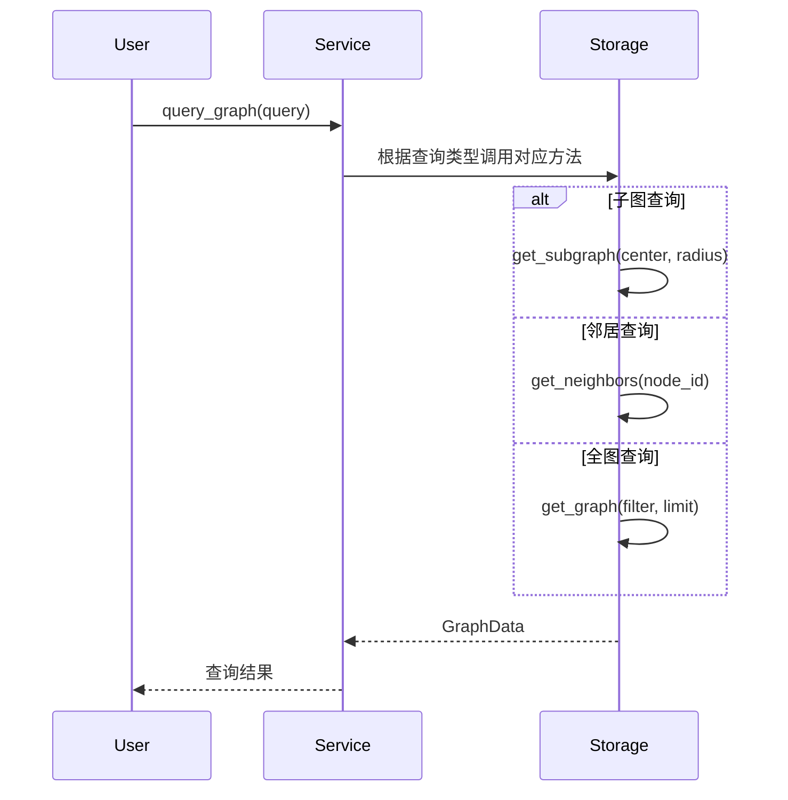

# 知识图谱模块架构详解

## 🎯 模块概述

知识图谱模块是费曼学习系统的核心组件之一，负责从文本中抽取结构化知识，构建语义关联的知识网络，并提供丰富的查询和分析功能。

## 📁 目录结构

```
src/feynman/core/graph/
├── __init__.py          # 模块初始化
├── schema.py            # 数据模型定义
├── extractor.py         # 知识抽取器
├── builder.py           # 图谱构建器  
├── storage.py           # 存储后端
└── service.py           # 服务层接口
```

## 🏗️ 架构设计

### 1. 分层架构

#### 1.1 外部接口层
- **API端点**: `/api/v1/kg/*` REST API接口
- **Agent调用**: 供对话Agent使用的知识查询接口
- **命令行工具**: 批量处理和管理工具

#### 1.2 服务层 (service.py)
- **KnowledgeGraphService**: 统一的服务接口
- 整合抽取器、构建器和存储后端
- 提供高层业务逻辑封装

#### 1.3 核心处理层
- **KnowledgeExtractor**: 知识抽取器
- **KnowledgeGraphBuilder**: 图谱构建器

#### 1.4 数据模型层 (schema.py) 
- 定义标准化的数据结构
- 保证组件间数据交换的一致性

#### 1.5 存储层 (storage.py)
- 抽象存储接口
- 支持多种存储后端

## 📋 核心组件详解

### 1. 数据模型 (schema.py)

#### 1.1 KnowledgeTriple - 知识三元组
```python
class KnowledgeTriple(BaseModel):
    subject: str        # 主体实体
    predicate: str      # 关系谓词  
    object: str         # 客体实体
    confidence: float   # 置信度 [0.0, 1.0]
    source: str         # 来源标识
    timestamp: datetime # 时间戳
```

**特点**:
- 标准的RDF三元组结构
- 支持置信度量化
- 来源可追溯性

#### 1.2 GraphNode - 图节点
```python
class GraphNode(BaseModel):
    id: str                      # 节点唯一ID
    label: str                   # 显示标签
    node_type: str              # 节点类型
    properties: Dict[str, Any]  # 扩展属性
    degree: int                 # 节点度数
```

#### 1.3 GraphEdge - 图边
```python
class GraphEdge(BaseModel):
    id: str                      # 边唯一ID
    source: str                  # 源节点ID
    target: str                  # 目标节点ID
    relationship: str            # 关系类型
    weight: float               # 边权重
    properties: Dict[str, Any]  # 扩展属性
```

#### 1.4 GraphData - 完整图结构
```python
class GraphData(BaseModel):
    nodes: List[GraphNode]       # 节点列表
    edges: List[GraphEdge]       # 边列表  
    metadata: Dict[str, Any]     # 元数据
```

### 2. 知识抽取器 (extractor.py)

#### 2.1 核心功能
- **实体识别**: 从文本中识别重要实体
- **关系抽取**: 识别实体间的语义关系
- **三元组生成**: 构造结构化的知识表示

#### 2.2 技术实现

##### LLM驱动抽取
```python
class KnowledgeExtractor:
    def __init__(self):
        self.llm = self._init_llm()  # 支持OpenAI和智谱AI
        self.extraction_prompt = self._create_extraction_prompt()
```

**提示词工程**:
```python
prompt = """
你是一个专业的知识图谱构建助手。请从以下文本中抽取结构化知识。

抽取规则：
1. 识别重要的实体（人名、概念、技术术语）
2. 识别实体间的关系（是什么、属于、使用、导致等）
3. 保持抽取的准确性，避免推测
4. 关系动词要规范化

输出格式：JSON格式的三元组数组
"""
```

##### 抽取流程
1. **文本预处理**: 清理和分段
2. **LLM调用**: 使用专门的提示词
3. **结果解析**: JSON格式解析
4. **质量过滤**: 置信度阈值过滤
5. **格式转换**: 转换为KnowledgeTriple对象

#### 2.3 多源支持
- **文本输入**: 直接处理文本内容
- **文件输入**: 支持多种文档格式
- **批量处理**: 支持大量文档的批量抽取

### 3. 图谱构建器 (builder.py)

#### 3.1 核心功能
- **实体合并**: 识别和合并相似实体
- **关系去重**: 合并重复的关系
- **图结构优化**: 提高图的连通性和质量

#### 3.2 构建流程

```python
def build_from_triples(self, triples: List[KnowledgeTriple]):
    # 1. 实体规范化和合并
    normalized_triples = self._normalize_and_merge_entities(triples)
    
    # 2. 关系去重和合并  
    merged_triples = self._merge_duplicate_relations(normalized_triples)
    
    # 3. 批量添加到存储
    added_count = self.storage.add_triples(merged_triples)
    
    # 4. 统计和分析
    stats = self.storage.get_stats()
```

#### 3.3 实体合并算法
```python
def _build_entity_mapping(self, entities: List[str]) -> Dict[str, str]:
    """使用字符串相似度算法合并相似实体"""
    similarity_threshold = 0.8
    
    for i, entity1 in enumerate(entities):
        for j, entity2 in enumerate(entities[i+1:], i+1):
            similarity = difflib.SequenceMatcher(None, entity1, entity2).ratio()
            if similarity >= similarity_threshold:
                # 合并实体逻辑
                pass
```

#### 3.4 质量保证
- **置信度加权**: 基于置信度合并重复关系
- **自环消除**: 避免实体指向自身的关系
- **连通性优化**: 提高图的整体连通性

### 4. 存储层 (storage.py)

#### 4.1 抽象接口设计
```python
class GraphStorageBackend(ABC):
    @abstractmethod
    def add_triple(self, triple: KnowledgeTriple) -> bool:
        """添加三元组"""
        pass
    
    @abstractmethod  
    def get_graph(self, topic_filter=None, limit=None) -> GraphData:
        """获取图数据"""
        pass
    
    @abstractmethod
    def get_subgraph(self, center_node: str, radius: int = 1) -> GraphData:
        """获取子图"""
        pass
```

#### 4.2 NetworkX存储实现
```python
class NetworkXStorage(GraphStorageBackend):
    def __init__(self, storage_path: str):
        self.graph = nx.MultiDiGraph()  # 多重有向图
        self.triples_data = {}          # 三元组详细信息
        self.storage_path = storage_path
```

**特点**:
- **多重有向图**: 支持同一对节点间的多条边
- **持久化存储**: JSON格式文件存储
- **内存操作**: NetworkX提供高效的图算法
- **实体规范化**: 统一的实体ID生成策略

#### 4.3 Neo4j存储实现
```python
class Neo4jStorage(GraphStorageBackend):
    def __init__(self, uri: str, username: str, password: str):
        self.driver = GraphDatabase.driver(uri, auth=(username, password))
```

**特点**:
- **原生图数据库**: 专为图数据设计
- **Cypher查询**: 强大的图查询语言
- **ACID事务**: 保证数据一致性
- **大规模支持**: 适合大型知识图谱

#### 4.4 存储功能
- **CRUD操作**: 增删改查三元组
- **复杂查询**: 子图查询、路径查询、邻居查询
- **统计分析**: 度数分布、连通性分析
- **数据导出**: 多种格式导出

### 5. 服务层 (service.py)

#### 5.1 统一服务接口
```python
class KnowledgeGraphService:
    def __init__(self):
        self.extractor = KnowledgeExtractor()
        self.storage = self._init_storage()
        self.builder = KnowledgeGraphBuilder(self.storage)
```

#### 5.2 核心业务方法

##### 图谱构建
```python
async def build_from_text(self, text: str, source: str) -> Dict[str, Any]:
    # 1. 抽取三元组
    triples = await self.extractor.extract_triples(text, source)
    
    # 2. 构建图谱
    result = self.builder.build_from_triples(triples)
    
    return result
```

##### 图谱查询
```python
def query_graph(self, query: KnowledgeGraphQuery) -> GraphData:
    if query.query_type == "subgraph":
        return self.storage.get_subgraph(query.center_node, query.radius)
    elif query.query_type == "neighbors":
        # 邻居查询逻辑
        pass
```

##### 统计分析
```python
def get_stats(self) -> Dict[str, Any]:
    basic_stats = self.storage.get_stats()
    structure_analysis = self.builder.analyze_graph_structure()
    importance_ranking = self.builder.get_entity_importance_ranking()
    
    return {
        "basic": basic_stats,
        "structure": structure_analysis, 
        "top_entities": importance_ranking
    }
```

#### 5.3 配置管理
- **存储后端选择**: 环境变量驱动
- **LLM模型配置**: 支持多种LLM
- **参数调优**: 相似度阈值、置信度阈值等

## 🔄 工作流程

### 1. 知识图谱构建流程



### 2. 图谱查询流程



## ⚡ 性能特性

### 1. 抽取性能
- **并行处理**: 支持多文档并行抽取
- **批量优化**: 批量调用LLM API
- **缓存机制**: 抽取结果缓存

### 2. 存储性能
- **内存操作**: NetworkX图结构在内存中操作
- **增量更新**: 支持增量添加三元组
- **索引优化**: 基于实体ID的快速查找

### 3. 查询性能
- **图算法优化**: 利用NetworkX的高效算法
- **结果缓存**: 常用查询结果缓存
- **分页支持**: 大结果集分页返回

## 🎯 使用示例

### 1. 基本使用
```python
from feynman.core.graph.service import get_knowledge_graph_service

# 获取服务实例
kg_service = get_knowledge_graph_service()

# 从文本构建图谱
result = await kg_service.build_from_text(
    text="人工智能是计算机科学的一个分支",
    source="ai_intro"
)

# 查询图谱统计
stats = kg_service.get_stats()
print(f"节点数: {stats['basic']['num_nodes']}")
print(f"边数: {stats['basic']['num_edges']}")

# 搜索实体
entities = kg_service.search_entities("人工智能", limit=5)
for entity in entities:
    print(f"实体: {entity['label']}, 类型: {entity['type']}")
```

### 2. 高级查询
```python
# 子图查询
subgraph = kg_service.storage.get_subgraph("人工智能", radius=2)
print(f"子图包含 {len(subgraph.nodes)} 个节点")

# 邻居查询
neighbors = kg_service.storage.get_neighbors("机器学习")
print(f"邻居节点: {neighbors}")

# 实体上下文
context = kg_service.get_entity_context("深度学习", radius=1)
print(f"相关三元组: {len(context['related_triples'])}")
```

### 3. 批量处理
```python
import asyncio

async def batch_build_kg(texts: List[str]):
    tasks = []
    for i, text in enumerate(texts):
        task = kg_service.build_from_text(text, f"doc_{i}")
        tasks.append(task)
    
    results = await asyncio.gather(*tasks)
    return results

# 使用示例
texts = ["文本1", "文本2", "文本3"]
results = await batch_build_kg(texts)
```

## 🔧 配置和扩展

### 1. 环境变量配置
```bash
# 存储后端选择
KG_BACKEND=local  # 或 neo4j
KG_STORAGE_PATH=data/knowledge_graph.json

# Neo4j配置
NEO4J_URI=bolt://localhost:7687
NEO4J_USERNAME=neo4j
NEO4J_PASSWORD=password

# LLM配置
OPENAI_API_KEY=your_openai_key
ZHIPU_API_KEY=your_zhipu_key
```

### 2. 自定义存储后端
```python
class CustomStorage(GraphStorageBackend):
    def add_triple(self, triple: KnowledgeTriple) -> bool:
        # 自定义存储逻辑
        pass
    
    def get_graph(self, topic_filter=None, limit=None) -> GraphData:
        # 自定义查询逻辑
        pass
```

### 3. 自定义抽取器
```python
class CustomExtractor:
    async def extract_triples(self, text: str) -> List[KnowledgeTriple]:
        # 自定义抽取逻辑
        pass
```

## 🎊 总结

知识图谱模块采用模块化、分层的架构设计，具有以下优势：

### ✅ 架构优势
- **模块化**: 各组件职责清晰，易于维护和扩展
- **抽象化**: 通过抽象接口支持多种实现
- **可配置**: 灵活的配置系统适应不同需求
- **可扩展**: 易于添加新的存储后端和抽取方法

### ⚡ 功能特性
- **智能抽取**: 基于LLM的高质量知识抽取
- **自动合并**: 智能的实体合并和关系去重
- **多样查询**: 支持多种图查询模式
- **实时分析**: 丰富的统计和分析功能

### 🚀 性能表现
- **高效存储**: NetworkX内存图结构 + 文件持久化
- **快速查询**: 优化的图算法和查询策略  
- **可扩展**: 支持Neo4j大规模图数据库

这个知识图谱模块为费曼学习系统提供了强大的知识表示和查询能力，是实现智能学习和知识发现的核心基础设施。
