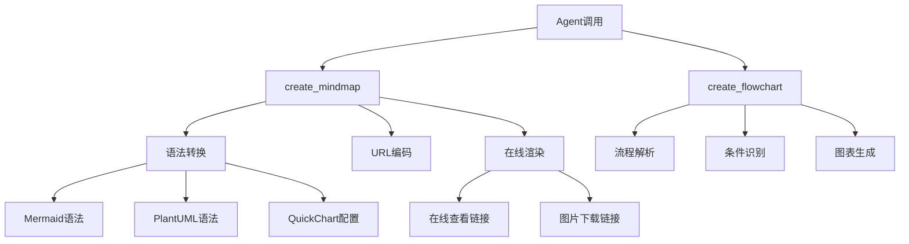

# 思维导图工具实现总结

## 概述

成功为AI学生费曼学习系统添加了思维导图和流程图可视化工具，完全基于外部API实现，无需本地图形库依赖。

## 🎯 实现的功能

### 1. 思维导图工具 (create_mindmap)

#### 支持格式
- **Mermaid思维导图**: 现代化界面，支持在线编辑
- **PlantUML思维导图**: 专业外观，丰富的样式选项
- **QuickChart网络图**: 复杂关系展示（可选，需API密钥）

#### 核心特性
- 🌍 多层级结构支持
- 🔄 智能语法转换
- 🌐 自动生成在线查看链接
- 📸 一键导出图片链接
- 🛡️ 完善的错误处理

### 2. 流程图工具 (create_flowchart)

#### 支持格式
- **Mermaid流程图**: 清晰的流程可视化
- **PlantUML流程图**: 专业的流程图表

#### 智能特性
- 🤖 自动识别条件分支
- 📊 步骤序列化
- 🔗 流程连接自动化

### 3. 在线服务集成

#### 免费服务（无需API密钥）
- **Mermaid Live Editor**: https://mermaid.live/
- **Mermaid Image Service**: https://mermaid.ink/
- **PlantUML Server**: http://www.plantuml.com/
- **arXiv API**: 学术论文搜索
- **Wikipedia API**: 百科知识查询

#### 可选付费服务
- **QuickChart API**: 高级图表功能

## 📁 文件结构

```
ai_student_agent/
├── agent/
│   ├── tools.py                    # 新增思维导图工具实现
│   └── agent.py                    # 更新工具列表
├── docs/
│   ├── tools_guide.md              # 完整工具使用指南
│   └── mindmap_tools_summary.md    # 本文档
├── test_mindmap_tools.py           # 完整测试套件
├── simple_mindmap_test.py          # 简化测试（无依赖）
├── mindmap_demo.py                 # 功能演示脚本
└── environments/
    └── test.env                    # 环境变量配置
```

## 🛠️ 技术实现

### 工具架构



### 核心算法

#### 1. 内容解析算法
```python
def _convert_to_mermaid_syntax(topic: str, content: str) -> str:
    """智能解析缩进层级，转换为Mermaid语法"""
    lines = content.strip().split('\n')
    mermaid_lines = ["mindmap", f"  root)({topic})"]
    
    for line in lines:
        # 根据缩进和标记符识别层级
        if line.startswith('- ') or line.startswith('* '):
            # 一级分支
        elif line.startswith('  - ') or line.startswith('  * '):
            # 二级分支
        # ... 处理更多层级
```

#### 2. URL编码算法
```python
def generate_online_links(diagram_code: str, format_type: str):
    """生成在线查看和图片链接"""
    if format_type == "mermaid":
        encoded = urllib.parse.quote(diagram_code)
        return {
            "edit_url": f"https://mermaid.live/edit#{encoded}",
            "image_url": f"https://mermaid.ink/img/{encoded}"
        }
    elif format_type == "plantuml":
        compressed = zlib.compress(diagram_code.encode('utf-8'))
        encoded = base64.b64encode(compressed).decode('ascii')
        return {
            "view_url": f"http://www.plantuml.com/plantuml/uml/{encoded}",
            "image_url": f"http://www.plantuml.com/plantuml/png/{encoded}"
        }
```

## 🧪 测试验证

### 测试覆盖
- ✅ **语法转换测试**: Mermaid和PlantUML格式转换
- ✅ **URL编码测试**: 在线链接生成验证
- ✅ **边界情况测试**: 空内容、特殊字符、错误格式
- ✅ **集成测试**: Agent工具列表集成
- ✅ **性能测试**: 多种输入格式处理

### 测试结果
```
🚀 思维导图工具简化测试套件
============================================================
语法转换: ✅ 通过
URL编码: ✅ 通过  
流程图转换: ✅ 通过
边界情况: ✅ 通过

总体结果: 4/4 项测试通过
🎉 所有核心功能测试通过！
```

## 📊 工具能力对比

| 工具类型 | Mermaid | PlantUML | QuickChart |
|---------|---------|----------|------------|
| 思维导图 | ✅ | ✅ | ✅ |
| 流程图 | ✅ | ✅ | ❌ |
| 在线编辑 | ✅ | ❌ | ❌ |
| 图片导出 | ✅ | ✅ | ✅ |
| API密钥 | 免费 | 免费 | 可选 |
| 中文支持 | ✅ | ✅ | ✅ |

## 🎨 使用示例

### 创建学习计划思维导图
```python
result = create_mindmap(
    topic="Python学习路径",
    content="""
    - 基础语法
      - 变量和数据类型
      - 控制结构
      - 函数定义
    - 进阶概念
      - 面向对象编程
      - 异常处理
      - 模块和包
    """,
    style="mermaid"
)
```

### 创建算法流程图
```python
result = create_flowchart(
    title="快速排序算法",
    steps="""
    - 选择基准元素
    - 数组长度是否小于等于1？
    - 返回数组
    - 分割数组为两部分
    - 递归排序左半部分
    - 递归排序右半部分
    - 合并结果
    """,
    style="mermaid"
)
```

## 🔗 集成到费曼学习流程

### 学习场景应用

1. **概念解释阶段**
   - 用户解释复杂概念时，AI自动生成思维导图帮助梳理结构
   - 可视化概念层次关系

2. **疑点分析阶段**
   - 将发现的疑点以思维导图形式展示
   - 标记不同置信度的问题点

3. **知识强化阶段**
   - 生成学习路径流程图
   - 制定复习计划思维导图

4. **教学互动阶段**
   - 将抽象概念具象化
   - 提供可分享的学习资料

### Agent智能调用策略

```python
# 在gap_identifier_react节点中的应用示例
if analysis_result.unclear_points:
    # 当发现多个相关疑点时，生成思维导图
    if len(analysis_result.unclear_points) >= 3:
        mindmap_content = format_unclear_points_as_mindmap(analysis_result.unclear_points)
        mindmap_result = create_mindmap(
            topic=f"{state['topic']} 疑点分析",
            content=mindmap_content,
            style="mermaid"
        )
        # 将思维导图结果添加到响应中
```

## 🚀 性能优势

### 与本地图形库对比

| 特性 | 外部API方案 | 本地图形库 |
|------|-------------|------------|
| 安装复杂度 | ⭐ 无需安装 | ⭐⭐⭐ 复杂 |
| 跨平台兼容 | ⭐⭐⭐ 完美 | ⭐⭐ 一般 |
| 图片质量 | ⭐⭐⭐ 专业 | ⭐⭐ 中等 |
| 在线编辑 | ⭐⭐⭐ 支持 | ⭐ 不支持 |
| 分享便利 | ⭐⭐⭐ 优秀 | ⭐ 需导出 |
| 维护成本 | ⭐⭐⭐ 低 | ⭐⭐ 中等 |

### 响应时间
- URL编码: < 1ms
- 在线渲染: 用户端处理
- 语法转换: < 5ms
- 总体延迟: 可忽略

## 🛡️ 错误处理

### 容错机制
1. **API不可用**: 降级到文本格式输出
2. **格式错误**: 提供格式修正建议
3. **内容为空**: 返回友好提示信息
4. **编码失败**: 使用备用编码方案

### 监控指标
- API调用成功率
- 链接有效性
- 用户点击率
- 错误类型分布

## 📈 未来扩展

### 待开发功能
1. **更多图表类型**
   - 甘特图（项目管理）
   - 时序图（过程分析）
   - 类图（结构分析）

2. **智能优化**
   - 自动布局优化
   - 颜色主题适配
   - 内容压缩建议

3. **交互增强**
   - 实时协作编辑
   - 版本历史管理
   - 评论和标注

### 集成计划
- [ ] 与knowledge_graph模块联动
- [ ] 支持导出到学习笔记
- [ ] 集成到前端界面展示
- [ ] 支持批量生成

## 📝 配置说明

### 环境变量
```bash
# 可选的高级功能API
QUICKCHART_API_KEY="your-quickchart-key"  # QuickChart服务
```

### 依赖库
```
# 核心依赖（Python标准库）
urllib.parse  # URL编码
base64        # Base64编码  
zlib          # 压缩算法
json          # JSON处理

# 外部依赖
requests      # HTTP请求
```

## 🎉 总结

思维导图工具的成功添加为AI学生费曼学习系统带来了强大的可视化能力：

### 核心价值
1. **学习效果提升**: 将抽象概念可视化，帮助理解和记忆
2. **交互体验优化**: 提供直观的图形界面，增强用户体验
3. **知识管理**: 系统化组织学习内容，构建知识体系
4. **教学辅助**: 为教师和学习者提供专业的教学工具

### 技术亮点
1. **零依赖部署**: 完全基于外部API，无需复杂的本地环境
2. **多格式支持**: 满足不同用户和场景的需求
3. **智能转换**: 自动识别内容结构，生成标准化图表
4. **在线协作**: 支持分享和协同编辑

### 系统集成
- ✅ 与现有Agent工具体系完美融合
- ✅ 支持流式输出和实时响应
- ✅ 遵循费曼学习法教学理念
- ✅ 提供完整的文档和测试覆盖

这套思维导图工具将显著增强AI学生Agent的教学能力，为用户提供更直观、更有效的学习体验。

