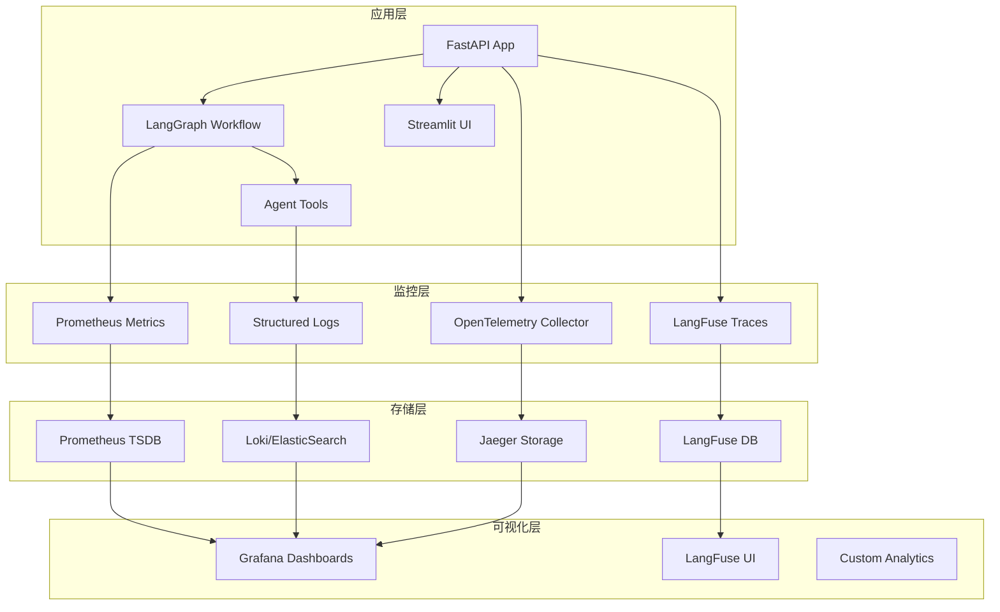

# AI学生费曼学习系统 - 监控与Tracing实施计划

## 一、现状分析

### 当前系统架构
- **后端**: FastAPI + LangGraph + 9个外部API工具
- **前端**: Streamlit + Next.js
- **存储**: ChromaDB (向量数据库) + 计划中的会话存储
- **特性**: 流式对话、工具调用链、异步记忆固化

### 现有监控基础
- 环境配置中已预留LangFuse、日志、指标配置
- logs目录已创建但未使用
- 缺乏系统性的监控与追踪机制

### 关键监控需求
1. **API性能监控**: /chat、/chat/stream、/memorize端点
2. **LangGraph工作流追踪**: 3节点流程监控
3. **工具调用监控**: 9个外部API工具的成功率、延迟、错误
4. **LLM观测**: token消耗、成本、模型切换(OpenAI/智谱AI)
5. **流式响应监控**: SSE连接稳定性、断线重连
6. **业务指标**: 用户满意度、对话完成率、记忆质量

---

## 二、技术选型与架构

### 2.1 监控栈选择

#### 方案A: 云服务优先 (推荐生产环境)
```
LangFuse (LLM追踪) + DataDog/NewRelic (APM) + Grafana Cloud (可视化)
```
- **优势**: 开箱即用、维护成本低、功能完整
- **劣势**: 成本较高、数据外流
- **适用**: 生产环境、团队规模较大

#### 方案B: 开源自建 (推荐开发/中小团队)
```
OpenTelemetry + Prometheus + Grafana + Jaeger + LangFuse
```
- **优势**: 成本低、可控性强、标准化
- **劣势**: 运维复杂度高
- **适用**: 开发环境、技术团队、成本敏感

#### 方案C: 轻量级混合 (推荐起步阶段)
```
LangFuse + Prometheus + 结构化日志 + 自建仪表板
```
- **优势**: 快速上手、核心功能覆盖
- **劣势**: 功能有限
- **适用**: MVP阶段、快速验证

### 2.2 监控架构设计



---

## 三、分层监控实施

### 3.1 基础设施监控

#### 系统指标
```python
# core/monitoring/system_metrics.py
from prometheus_client import Gauge, Counter, Histogram
import psutil
import time

# 系统资源指标
CPU_USAGE = Gauge('system_cpu_usage_percent', 'CPU使用率')
MEMORY_USAGE = Gauge('system_memory_usage_bytes', '内存使用量')
DISK_USAGE = Gauge('system_disk_usage_bytes', '磁盘使用量')

# 数据库连接指标
DB_CONNECTIONS = Gauge('database_connections_active', '活跃数据库连接数')
CHROMADB_QUERIES = Counter('chromadb_queries_total', 'ChromaDB查询总数', ['operation'])
CHROMADB_LATENCY = Histogram('chromadb_query_duration_seconds', 'ChromaDB查询延迟')
```

#### 外部依赖监控
```python
# core/monitoring/external_apis.py
from prometheus_client import Counter, Histogram, Gauge
import aiohttp
import time

# API调用指标
EXTERNAL_API_REQUESTS = Counter(
    'external_api_requests_total', 
    '外部API请求总数', 
    ['service', 'endpoint', 'status_code']
)
EXTERNAL_API_LATENCY = Histogram(
    'external_api_request_duration_seconds',
    '外部API请求延迟',
    ['service', 'endpoint']
)
EXTERNAL_API_ERRORS = Counter(
    'external_api_errors_total',
    '外部API错误总数',
    ['service', 'error_type']
)

# API额度监控
API_QUOTA_REMAINING = Gauge(
    'external_api_quota_remaining',
    'API剩余配额',
    ['service']
)
```

### 3.2 应用层监控

#### FastAPI中间件
```python
# api/middleware/monitoring.py
import time
import uuid
from starlette.middleware.base import BaseHTTPMiddleware
from starlette.requests import Request
from starlette.responses import Response
from prometheus_client import Counter, Histogram
import logging

# API指标
API_REQUESTS = Counter(
    'fastapi_requests_total',
    'API请求总数', 
    ['method', 'endpoint', 'status_code']
)
API_LATENCY = Histogram(
    'fastapi_request_duration_seconds',
    'API请求延迟',
    ['method', 'endpoint']
)
ACTIVE_CONNECTIONS = Gauge('fastapi_active_connections', '活跃连接数')

class MonitoringMiddleware(BaseHTTPMiddleware):
    async def dispatch(self, request: Request, call_next):
        start_time = time.time()
        request_id = str(uuid.uuid4())
        
        # 添加请求ID到上下文
        request.state.request_id = request_id
        
        try:
            response = await call_next(request)
            
            # 记录指标
            duration = time.time() - start_time
            API_REQUESTS.labels(
                method=request.method,
                endpoint=request.url.path,
                status_code=response.status_code
            ).inc()
            API_LATENCY.labels(
                method=request.method,
                endpoint=request.url.path
            ).observe(duration)
            
            # 结构化日志
            logging.info({
                "event": "api_request",
                "request_id": request_id,
                "method": request.method,
                "path": request.url.path,
                "status_code": response.status_code,
                "duration_ms": duration * 1000,
                "user_agent": request.headers.get("user-agent"),
                "ip": request.client.host
            })
            
            return response
            
        except Exception as e:
            # 错误处理和记录
            API_REQUESTS.labels(
                method=request.method,
                endpoint=request.url.path,
                status_code=500
            ).inc()
            
            logging.error({
                "event": "api_error",
                "request_id": request_id,
                "method": request.method,
                "path": request.url.path,
                "error": str(e),
                "duration_ms": (time.time() - start_time) * 1000
            })
            raise
```

#### 流式响应监控
```python
# api/middleware/streaming_monitor.py
from prometheus_client import Counter, Histogram, Gauge
import time
import asyncio

# 流式指标
STREAM_CONNECTIONS = Gauge('sse_connections_active', '活跃SSE连接数')
STREAM_MESSAGES = Counter('sse_messages_total', 'SSE消息总数', ['session_id'])
STREAM_DISCONNECTS = Counter('sse_disconnects_total', 'SSE断开总数', ['reason'])
STREAM_DURATION = Histogram('sse_connection_duration_seconds', 'SSE连接持续时间')

class StreamingMonitor:
    def __init__(self):
        self.active_streams = {}
    
    async def track_stream_start(self, session_id: str):
        STREAM_CONNECTIONS.inc()
        self.active_streams[session_id] = time.time()
    
    async def track_stream_message(self, session_id: str):
        STREAM_MESSAGES.labels(session_id=session_id).inc()
    
    async def track_stream_end(self, session_id: str, reason: str = "completed"):
        STREAM_CONNECTIONS.dec()
        STREAM_DISCONNECTS.labels(reason=reason).inc()
        
        if session_id in self.active_streams:
            duration = time.time() - self.active_streams[session_id]
            STREAM_DURATION.observe(duration)
            del self.active_streams[session_id]
```

### 3.3 业务层监控

#### LangGraph工作流追踪
```python
# agent/monitoring/workflow_tracer.py
from prometheus_client import Counter, Histogram, Gauge
from opentelemetry import trace
from opentelemetry.trace import Status, StatusCode
import time
import json

# 工作流指标
WORKFLOW_EXECUTIONS = Counter(
    'langgraph_workflow_executions_total',
    'LangGraph工作流执行总数',
    ['node_name', 'status']
)
WORKFLOW_DURATION = Histogram(
    'langgraph_workflow_duration_seconds',
    'LangGraph工作流执行时间',
    ['node_name']
)
WORKFLOW_QUEUE_SIZE = Gauge('langgraph_workflow_queue_size', '工作流队列大小')

tracer = trace.get_tracer(__name__)

class WorkflowTracer:
    def __init__(self):
        self.active_workflows = {}
    
    async def trace_node_execution(self, node_name: str, inputs: dict, func):
        """追踪单个节点的执行"""
        with tracer.start_as_current_span(f"langgraph.{node_name}") as span:
            span.set_attributes({
                "langgraph.node.name": node_name,
                "langgraph.inputs.topic": inputs.get("topic", ""),
                "langgraph.inputs.memory_count": len(inputs.get("short_term_memory", []))
            })
            
            start_time = time.time()
            try:
                result = await func(inputs)
                
                # 成功指标
                duration = time.time() - start_time
                WORKFLOW_EXECUTIONS.labels(
                    node_name=node_name,
                    status="success"
                ).inc()
                WORKFLOW_DURATION.labels(node_name=node_name).observe(duration)
                
                # 添加结果信息到span
                if isinstance(result, dict):
                    span.set_attributes({
                        "langgraph.outputs.questions_count": len(result.get("question_queue", [])),
                        "langgraph.outputs.memory_updated": len(result.get("short_term_memory", []))
                    })
                
                span.set_status(Status(StatusCode.OK))
                return result
                
            except Exception as e:
                # 错误指标
                WORKFLOW_EXECUTIONS.labels(
                    node_name=node_name,
                    status="error"
                ).inc()
                
                span.set_status(Status(StatusCode.ERROR, str(e)))
                span.record_exception(e)
                raise
```

#### 工具调用监控
```python
# agent/monitoring/tool_tracer.py
from prometheus_client import Counter, Histogram
from opentelemetry import trace
import time
import functools

# 工具调用指标
TOOL_CALLS = Counter(
    'agent_tool_calls_total',
    '工具调用总数',
    ['tool_name', 'status']
)
TOOL_LATENCY = Histogram(
    'agent_tool_call_duration_seconds',
    '工具调用延迟',
    ['tool_name']
)
TOOL_ERRORS = Counter(
    'agent_tool_errors_total',
    '工具调用错误总数',
    ['tool_name', 'error_type']
)

def monitor_tool_call(tool_name: str):
    """装饰器：监控工具调用"""
    def decorator(func):
        @functools.wraps(func)
        async def wrapper(*args, **kwargs):
            tracer = trace.get_tracer(__name__)
            
            with tracer.start_as_current_span(f"tool.{tool_name}") as span:
                span.set_attributes({
                    "tool.name": tool_name,
                    "tool.args": str(args)[:500],  # 截断长参数
                    "tool.kwargs": str(kwargs)[:500]
                })
                
                start_time = time.time()
                try:
                    result = await func(*args, **kwargs) if asyncio.iscoroutinefunction(func) else func(*args, **kwargs)
                    
                    # 成功指标
                    duration = time.time() - start_time
                    TOOL_CALLS.labels(tool_name=tool_name, status="success").inc()
                    TOOL_LATENCY.labels(tool_name=tool_name).observe(duration)
                    
                    span.set_attributes({
                        "tool.result_length": len(str(result)),
                        "tool.duration_ms": duration * 1000
                    })
                    
                    return result
                    
                except Exception as e:
                    # 错误指标
                    TOOL_CALLS.labels(tool_name=tool_name, status="error").inc()
                    TOOL_ERRORS.labels(
                        tool_name=tool_name,
                        error_type=type(e).__name__
                    ).inc()
                    
                    span.record_exception(e)
                    raise
                    
        return wrapper
    return decorator
```

### 3.4 LLM观测

#### LangFuse集成
```python
# core/monitoring/langfuse_integration.py
import os
from langfuse import Langfuse
from langfuse.callback import CallbackHandler
from langchain.callbacks.base import BaseCallbackHandler

# 初始化LangFuse
langfuse = Langfuse(
    public_key=os.getenv("LANGFUSE_PUBLIC_KEY"),
    secret_key=os.getenv("LANGFUSE_SECRET_KEY"),
    host=os.getenv("LANGFUSE_HOST", "https://cloud.langfuse.com")
)

class CustomLangfuseCallback(BaseCallbackHandler):
    """自定义LangFuse回调处理器"""
    
    def __init__(self, session_id: str, user_id: str = "anonymous"):
        self.handler = CallbackHandler(
            public_key=os.getenv("LANGFUSE_PUBLIC_KEY"),
            secret_key=os.getenv("LANGFUSE_SECRET_KEY"),
            host=os.getenv("LANGFUSE_HOST"),
            session_id=session_id,
            user_id=user_id
        )
    
    def on_llm_start(self, serialized, prompts, **kwargs):
        """LLM开始时的回调"""
        self.handler.on_llm_start(serialized, prompts, **kwargs)
    
    def on_llm_end(self, response, **kwargs):
        """LLM结束时的回调"""
        self.handler.on_llm_end(response, **kwargs)
        
        # 自定义指标收集
        if hasattr(response, 'llm_output'):
            token_usage = response.llm_output.get('token_usage', {})
            
            # 记录token使用
            langfuse.score(
                name="token_efficiency",
                value=token_usage.get('completion_tokens', 0) / max(token_usage.get('prompt_tokens', 1), 1),
                trace_id=self.handler.trace_id
            )
    
    def on_tool_start(self, serialized, input_str, **kwargs):
        """工具开始时的回调"""
        self.handler.on_tool_start(serialized, input_str, **kwargs)
    
    def on_tool_end(self, output, **kwargs):
        """工具结束时的回调"""
        self.handler.on_tool_end(output, **kwargs)
```

#### Token成本追踪
```python
# core/monitoring/cost_tracker.py
from prometheus_client import Counter, Gauge
import os

# Token和成本指标
TOKEN_USAGE = Counter(
    'llm_tokens_used_total',
    'LLM Token使用总数',
    ['model', 'type']  # type: prompt/completion
)
LLM_COSTS = Counter(
    'llm_costs_total_usd',
    'LLM调用总成本(USD)',
    ['model', 'provider']
)
DAILY_COSTS = Gauge(
    'llm_daily_costs_usd',
    '每日LLM成本(USD)',
    ['date']
)

# 模型定价 (2024年价格)
MODEL_PRICING = {
    "gpt-4o": {"prompt": 0.005, "completion": 0.015},  # per 1K tokens
    "gpt-4": {"prompt": 0.03, "completion": 0.06},
    "gpt-3.5-turbo": {"prompt": 0.001, "completion": 0.002},
    "glm-4": {"prompt": 0.001, "completion": 0.001},  # 智谱AI定价
}

class CostTracker:
    def track_token_usage(self, model: str, prompt_tokens: int, completion_tokens: int):
        """追踪token使用和成本"""
        provider = "openai" if model.startswith("gpt") else "zhipu"
        
        # 记录token使用
        TOKEN_USAGE.labels(model=model, type="prompt").inc(prompt_tokens)
        TOKEN_USAGE.labels(model=model, type="completion").inc(completion_tokens)
        
        # 计算成本
        if model in MODEL_PRICING:
            pricing = MODEL_PRICING[model]
            prompt_cost = (prompt_tokens / 1000) * pricing["prompt"]
            completion_cost = (completion_tokens / 1000) * pricing["completion"]
            total_cost = prompt_cost + completion_cost
            
            LLM_COSTS.labels(model=model, provider=provider).inc(total_cost)
```

---

## 四、日志与告警

### 4.1 结构化日志
```python
# core/logging/structured_logger.py
import logging
import json
import sys
from datetime import datetime
from typing import Dict, Any

class StructuredFormatter(logging.Formatter):
    """结构化日志格式化器"""
    
    def format(self, record):
        log_entry = {
            "timestamp": datetime.utcnow().isoformat() + "Z",
            "level": record.levelname,
            "logger": record.name,
            "message": record.getMessage(),
            "module": record.module,
            "function": record.funcName,
            "line": record.lineno
        }
        
        # 添加请求上下文
        if hasattr(record, 'request_id'):
            log_entry["request_id"] = record.request_id
        if hasattr(record, 'session_id'):
            log_entry["session_id"] = record.session_id
        if hasattr(record, 'user_id'):
            log_entry["user_id"] = record.user_id
            
        # 添加自定义字段
        if hasattr(record, 'extra'):
            log_entry.update(record.extra)
            
        return json.dumps(log_entry, ensure_ascii=False)

def setup_logging():
    """配置结构化日志"""
    # 根据环境变量配置日志级别
    log_level = os.getenv("LOG_LEVEL", "INFO").upper()
    log_format = os.getenv("LOG_FORMAT", "json").lower()
    
    if log_format == "json":
        formatter = StructuredFormatter()
    else:
        formatter = logging.Formatter(
            '%(asctime)s - %(name)s - %(levelname)s - %(message)s'
        )
    
    # 配置处理器
    handler = logging.StreamHandler(sys.stdout)
    handler.setFormatter(formatter)
    
    # 配置根日志器
    logging.root.setLevel(getattr(logging, log_level))
    logging.root.addHandler(handler)
    
    # 配置第三方库日志级别
    logging.getLogger("uvicorn").setLevel(logging.WARNING)
    logging.getLogger("httpx").setLevel(logging.WARNING)
```

### 4.2 告警规则
```yaml
# config/alerting_rules.yml
groups:
- name: feynman_system_alerts
  rules:
  - alert: HighAPILatency
    expr: histogram_quantile(0.95, fastapi_request_duration_seconds) > 5
    for: 2m
    labels:
      severity: warning
    annotations:
      summary: "API响应延迟过高"
      description: "95分位API延迟 {{ $value }}秒，超过5秒阈值"

  - alert: HighErrorRate
    expr: rate(fastapi_requests_total{status_code=~"5.."}[5m]) > 0.1
    for: 1m
    labels:
      severity: critical
    annotations:
      summary: "API错误率过高"
      description: "5分钟内API错误率 {{ $value }}，超过10%阈值"

  - alert: ToolCallFailures
    expr: rate(agent_tool_errors_total[5m]) > 0.05
    for: 2m
    labels:
      severity: warning
    annotations:
      summary: "工具调用失败率过高"
      description: "工具 {{ $labels.tool_name }} 失败率过高"

  - alert: ExternalAPIDown
    expr: up{job="external_apis"} == 0
    for: 1m
    labels:
      severity: critical
    annotations:
      summary: "外部API服务不可用"
      description: "外部API {{ $labels.service }} 连续1分钟不可用"

  - alert: HighTokenUsage
    expr: increase(llm_tokens_used_total[1h]) > 1000000
    for: 5m
    labels:
      severity: warning
    annotations:
      summary: "Token使用量过高"
      description: "1小时内Token使用量超过100万"

  - alert: DailyCostExceeded
    expr: llm_daily_costs_usd > 100
    for: 0m
    labels:
      severity: critical
    annotations:
      summary: "每日成本预算超支"
      description: "每日LLM成本 ${{ $value }} 超过预算"
```

---

## 五、可视化面板

### 5.1 Grafana仪表板

#### 系统概览面板
```json
{
  "dashboard": {
    "title": "费曼学习系统 - 系统概览",
    "panels": [
      {
        "title": "API请求概览",
        "type": "stat",
        "targets": [
          {
            "expr": "sum(rate(fastapi_requests_total[5m]))",
            "legendFormat": "RPS"
          }
        ]
      },
      {
        "title": "API延迟分布",
        "type": "graph",
        "targets": [
          {
            "expr": "histogram_quantile(0.50, fastapi_request_duration_seconds)",
            "legendFormat": "P50"
          },
          {
            "expr": "histogram_quantile(0.95, fastapi_request_duration_seconds)",
            "legendFormat": "P95"
          }
        ]
      },
      {
        "title": "工具调用成功率",
        "type": "bargauge",
        "targets": [
          {
            "expr": "rate(agent_tool_calls_total{status=\"success\"}[5m]) / rate(agent_tool_calls_total[5m])",
            "legendFormat": "{{ tool_name }}"
          }
        ]
      },
      {
        "title": "Token使用趋势",
        "type": "graph",
        "targets": [
          {
            "expr": "rate(llm_tokens_used_total[5m])",
            "legendFormat": "{{ model }} - {{ type }}"
          }
        ]
      }
    ]
  }
}
```

#### 业务监控面板
```json
{
  "dashboard": {
    "title": "费曼学习系统 - 业务指标",
    "panels": [
      {
        "title": "对话完成率",
        "type": "stat",
        "targets": [
          {
            "expr": "rate(langgraph_workflow_executions_total{status=\"success\"}[1h]) / rate(langgraph_workflow_executions_total[1h])",
            "legendFormat": "完成率"
          }
        ]
      },
      {
        "title": "用户活跃度",
        "type": "graph",
        "targets": [
          {
            "expr": "count(increase(fastapi_requests_total{endpoint=\"/chat\"}[1h]))",
            "legendFormat": "活跃用户数"
          }
        ]
      },
      {
        "title": "记忆固化成功率",
        "type": "stat",
        "targets": [
          {
            "expr": "rate(memory_operations_total{operation=\"add\", status=\"success\"}[1h]) / rate(memory_operations_total{operation=\"add\"}[1h])",
            "legendFormat": "记忆成功率"
          }
        ]
      }
    ]
  }
}
```

### 5.2 自定义分析面板
```python
# core/analytics/custom_dashboard.py
from fastapi import APIRouter
from prometheus_client import generate_latest, CONTENT_TYPE_LATEST
import json

analytics_router = APIRouter()

@analytics_router.get("/analytics/summary")
async def get_analytics_summary():
    """获取分析摘要"""
    # 从Prometheus查询当前指标
    current_rps = await query_prometheus("sum(rate(fastapi_requests_total[5m]))")
    avg_latency = await query_prometheus("avg(fastapi_request_duration_seconds)")
    success_rate = await query_prometheus("rate(fastapi_requests_total{status_code!~\"5..\"}[5m]) / rate(fastapi_requests_total[5m])")
    
    return {
        "system_health": {
            "rps": current_rps,
            "avg_latency_ms": avg_latency * 1000,
            "success_rate": success_rate,
            "status": "healthy" if success_rate > 0.95 else "degraded"
        },
        "business_metrics": {
            "daily_conversations": await get_daily_conversations(),
            "tool_usage_top5": await get_top_tools(),
            "user_satisfaction": await get_satisfaction_score()
        },
        "cost_metrics": {
            "daily_token_cost": await get_daily_token_cost(),
            "cost_per_conversation": await get_cost_per_conversation()
        }
    }

@analytics_router.get("/metrics")
async def metrics():
    """Prometheus指标端点"""
    return Response(generate_latest(), media_type=CONTENT_TYPE_LATEST)
```

---

## 六、实施路线图

### Phase 1: 基础监控 (第1-2周)
- [ ] **环境配置**: 更新environments/test.env，添加监控相关配置
- [ ] **依赖安装**: 添加prometheus-client, opentelemetry, langfuse到requirements.txt
- [ ] **结构化日志**: 实现structured_logger.py，配置JSON格式日志
- [ ] **基础指标**: 添加API性能监控中间件到FastAPI
- [ ] **健康检查**: 实现/health端点，监控系统状态

### Phase 2: 分布式追踪 (第3-4周)
- [ ] **OpenTelemetry集成**: 配置OTLP导出器和追踪器
- [ ] **LangGraph追踪**: 在agent.py中添加工作流追踪
- [ ] **工具调用监控**: 为9个工具添加@monitor_tool_call装饰器
- [ ] **外部API监控**: 监控百度翻译、WolframAlpha等API调用
- [ ] **流式响应追踪**: 为SSE连接添加监控

### Phase 3: LLM观测 (第5周)
- [ ] **LangFuse集成**: 配置LangFuse追踪LLM调用
- [ ] **Token成本追踪**: 实现token使用和成本监控
- [ ] **模型性能分析**: 监控OpenAI和智谱AI模型切换效果
- [ ] **对话质量评估**: 集成评估指标(完成率、满意度)

### Phase 4: 可视化与告警 (第6周)
- [ ] **Prometheus部署**: 配置Prometheus服务器
- [ ] **Grafana面板**: 创建系统概览和业务监控面板
- [ ] **告警规则**: 配置关键指标告警
- [ ] **通知集成**: 接入钉钉/企业微信/邮件通知

### Phase 5: 高级分析 (第7-8周)
- [ ] **自定义分析**: 实现业务指标分析API
- [ ] **性能优化**: 基于监控数据优化系统性能
- [ ] **容量规划**: 建立资源使用预测模型
- [ ] **运维手册**: 编写监控运维文档

---

## 七、配置与部署

### 7.1 环境变量配置
```env
# 监控与追踪配置
MONITORING_ENABLED=true
METRICS_ENABLED=true
TRACING_ENABLED=true

# Prometheus配置
PROMETHEUS_PORT=9090
METRICS_ENDPOINT=/metrics
METRICS_SCRAPE_INTERVAL=15s

# OpenTelemetry配置
OTEL_SERVICE_NAME=feynman-learning-system
OTEL_EXPORTER_OTLP_ENDPOINT=http://localhost:4317
OTEL_RESOURCE_ATTRIBUTES=service.name=feynman,service.version=3.2

# LangFuse配置 (已有)
LANGFUSE_PUBLIC_KEY=pk-lf-your-public-key
LANGFUSE_SECRET_KEY=sk-lf-your-secret-key
LANGFUSE_HOST=https://cloud.langfuse.com

# 告警配置
ALERTING_ENABLED=true
WEBHOOK_URL=https://hooks.slack.com/your-webhook
EMAIL_ALERTS=admin@company.com

# 成本控制
DAILY_COST_LIMIT_USD=100
TOKEN_RATE_LIMIT=10000
COST_TRACKING_ENABLED=true
```

### 7.2 Docker部署配置
```yaml
# docker-compose.monitoring.yml
version: '3.8'
services:
  feynman-app:
    build: .
    environment:
      - MONITORING_ENABLED=true
      - METRICS_ENABLED=true
    ports:
      - "8000:8000"
    
  prometheus:
    image: prom/prometheus:latest
    ports:
      - "9090:9090"
    volumes:
      - ./config/prometheus.yml:/etc/prometheus/prometheus.yml
      - ./config/alerting_rules.yml:/etc/prometheus/alerting_rules.yml
    
  grafana:
    image: grafana/grafana:latest
    ports:
      - "3000:3000"
    environment:
      - GF_SECURITY_ADMIN_PASSWORD=admin
    volumes:
      - ./config/grafana/dashboards:/var/lib/grafana/dashboards
      - ./config/grafana/provisioning:/etc/grafana/provisioning
    
  jaeger:
    image: jaegertracing/all-in-one:latest
    ports:
      - "16686:16686"
      - "14268:14268"
    environment:
      - COLLECTOR_OTLP_ENABLED=true
```

---

## 八、成功指标与ROI

### 8.1 技术指标
- **系统可用性**: > 99.5%
- **API响应时间**: P95 < 2秒
- **错误率**: < 1%
- **MTTR**: < 15分钟
- **监控覆盖率**: > 95%

### 8.2 业务指标
- **对话完成率**: > 85%
- **用户满意度**: > 4.2/5
- **工具调用成功率**: > 95%
- **记忆固化成功率**: > 98%

### 8.3 成本效益
- **运维效率提升**: 60%
- **故障发现时间缩短**: 80%
- **成本可控性**: 日成本不超过预算
- **团队生产力**: 问题定位时间减少70%

---

## 九、后续规划

### 9.1 AI驱动的运维
- **异常检测**: 使用ML算法自动检测异常模式
- **智能告警**: 减少误报，提高告警准确性
- **自动扩缩容**: 基于负载预测的资源调度
- **性能调优建议**: AI分析性能瓶颈并给出优化建议

### 9.2 高级分析
- **用户行为分析**: 深入了解用户使用模式
- **对话质量评估**: 自动评估对话效果
- **知识图谱分析**: 监控知识构建质量
- **A/B测试平台**: 支持功能效果对比

### 9.3 生态集成
- **CI/CD集成**: 监控集成到部署流水线
- **第三方服务**: 集成更多外部监控服务
- **数据湖**: 长期数据存储和分析
- **合规审计**: 满足数据安全和隐私要求

---

## 总结

这个监控与Tracing方案提供了全方位的系统观测能力，从基础设施到业务指标的完整覆盖。通过分阶段实施，可以快速建立起有效的监控体系，为系统的稳定运行和持续优化提供数据支撑。

关键特点：
- **全栈覆盖**: API、工作流、工具、LLM的完整监控
- **实时观测**: 毫秒级的指标收集和告警
- **成本可控**: Token使用和API成本的精确追踪
- **可扩展性**: 模块化设计，易于扩展新的监控维度
- **开源优先**: 降低技术栈复杂度和成本

建议优先实施Phase 1-2，建立基础监控能力，然后根据实际需求逐步完善后续功能。

