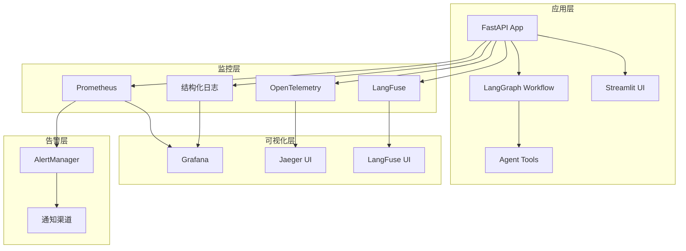
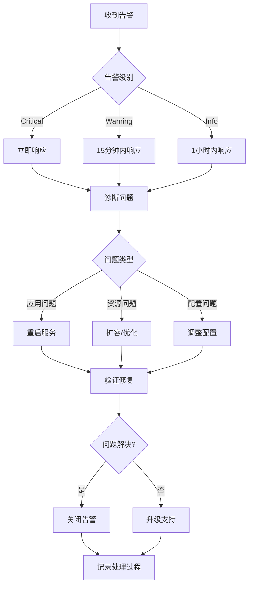

# 费曼学习系统 - 监控运维指南

## 一、监控架构概览

### 1.1 监控组件



### 1.2 端口分配

| 服务 | 端口 | 用途 | 访问地址 |
|------|------|------|----------|
| Feynman API | 8000 | 主应用API | http://localhost:8000 |
| Streamlit UI | 8501 | Web界面 | http://localhost:8501 |
| Prometheus | 9090 | 指标收集 | http://localhost:9090 |
| Grafana | 3000 | 监控面板 | http://localhost:3000 |
| Jaeger | 16686 | 链路追踪 | http://localhost:16686 |
| AlertManager | 9093 | 告警管理 | http://localhost:9093 |
| Node Exporter | 9100 | 系统指标 | http://localhost:9100 |
| Blackbox Exporter | 9115 | 外部监控 | http://localhost:9115 |
| LangFuse | 3001 | LLM观测 | http://localhost:3001 |

---

## 二、快速启动

### 2.1 环境准备

```bash
# 1. 确保Docker环境
docker --version
docker-compose --version

# 2. 检查配置文件
ls -la config/

# 3. 创建数据目录
mkdir -p logs data/{prometheus,grafana,alertmanager}
```

### 2.2 启动监控栈

```bash
# 方式A: 使用脚本（推荐）
./scripts/monitoring/start_monitoring.sh

# 方式B: 手动启动
cd config
docker-compose -f docker-compose.monitoring.yml up -d

# 检查服务状态
docker-compose -f docker-compose.monitoring.yml ps
```

### 2.3 验证部署

```bash
# 健康检查
curl http://localhost:8000/health
curl http://localhost:9090/-/healthy
curl http://localhost:3000/api/health

# 检查指标
curl http://localhost:8000/metrics

# 运行监控测试
uv run python test_monitoring.py
```

---

## 三、监控配置

### 3.1 环境变量配置

```env
# 基础监控开关
MONITORING_ENABLED=true
METRICS_ENABLED=true
TRACING_ENABLED=true

# 日志配置
LOG_LEVEL=INFO
LOG_FORMAT=json
LOG_FILE=logs/feynman.log

# Prometheus配置
PROMETHEUS_PORT=9090
METRICS_ENDPOINT=/metrics

# OpenTelemetry配置
OTEL_SERVICE_NAME=feynman-learning-system
OTEL_EXPORTER_OTLP_ENDPOINT=http://localhost:4317

# LangFuse配置
LANGFUSE_PUBLIC_KEY=pk-lf-your-key
LANGFUSE_SECRET_KEY=sk-lf-your-key
LANGFUSE_HOST=https://cloud.langfuse.com

# 成本控制
DAILY_COST_LIMIT_USD=100
MONTHLY_COST_LIMIT_USD=1000
```

### 3.2 自定义监控指标

在应用代码中添加自定义指标：

```python
from core.monitoring.metrics import (
    API_REQUESTS_TOTAL, TOOL_CALLS_TOTAL, LLM_TOKENS_USED_TOTAL
)

# 记录API请求
API_REQUESTS_TOTAL.labels(
    method="POST", 
    endpoint="/chat", 
    status_code=200
).inc()

# 记录工具调用
TOOL_CALLS_TOTAL.labels(
    tool_name="web_search", 
    status="success"
).inc()

# 记录Token使用
LLM_TOKENS_USED_TOTAL.labels(
    model="gpt-4", 
    type="completion"
).inc(150)
```

---

## 四、运维操作

### 4.1 日常检查

#### 每日检查清单
- [ ] 检查系统健康状态：`curl http://localhost:8000/health`
- [ ] 查看Grafana仪表板异常指标
- [ ] 检查AlertManager告警：`http://localhost:9093`
- [ ] 查看成本使用：`curl http://localhost:8000/monitoring/costs`
- [ ] 检查日志文件大小：`ls -lh logs/`

#### 每周检查清单
- [ ] 审查LangFuse对话质量报告
- [ ] 分析工具使用统计和优化机会
- [ ] 检查外部API配额使用情况
- [ ] 清理旧日志文件
- [ ] 更新监控配置和告警阈值

### 4.2 故障排查

#### 常见问题

**问题1: Prometheus无法抓取指标**
```bash
# 检查应用是否暴露指标端点
curl http://localhost:8000/metrics

# 检查Prometheus配置
docker exec prometheus_container cat /etc/prometheus/prometheus.yml

# 查看Prometheus日志
docker-compose -f config/docker-compose.monitoring.yml logs prometheus
```

**问题2: Grafana无法连接数据源**
```bash
# 检查网络连通性
docker exec grafana_container ping prometheus

# 重启Grafana
docker-compose -f config/docker-compose.monitoring.yml restart grafana
```

**问题3: 告警不触发**
```bash
# 检查告警规则语法
promtool check rules config/alerting_rules.yml

# 查看AlertManager配置
curl http://localhost:9093/api/v1/status

# 测试告警规则
curl -X POST http://localhost:9093/api/v1/alerts
```

### 4.3 性能优化

#### 指标收集优化
```yaml
# prometheus.yml 优化建议
global:
  scrape_interval: 15s      # 生产环境可调至30s
  evaluation_interval: 15s
  
scrape_configs:
  - job_name: 'feynman-api'
    scrape_interval: 5s     # 关键服务保持高频率
    metrics_path: '/metrics'
```

#### 存储优化
```bash
# 清理旧的时序数据
docker exec prometheus_container \
  promtool tsdb delete-series \
  --match='{__name__=~"old_metric_.*"}'

# 压缩数据
docker exec prometheus_container \
  promtool tsdb compact /prometheus
```

---

## 五、告警管理

### 5.1 告警级别

| 级别 | 含义 | 响应时间 | 通知方式 |
|------|------|----------|----------|
| Critical | 系统不可用或严重影响用户 | 立即 | 邮件+短信+电话 |
| Warning | 性能降级或潜在问题 | 15分钟内 | 邮件+即时消息 |
| Info | 一般信息或容量提醒 | 1小时内 | 即时消息 |

### 5.2 关键告警

#### API告警
- **HighAPILatency**: API延迟超过5秒
- **HighAPIErrorRate**: 错误率超过5%
- **APIServiceDown**: 服务不可用

#### 业务告警
- **HighConversationAbandonRate**: 对话放弃率超过30%
- **LowUserSatisfaction**: 用户满意度低于3.0
- **DailyCostExceeded**: 日成本超过预算

#### 系统告警
- **HighCPUUsage**: CPU使用率超过80%
- **HighMemoryUsage**: 内存使用率超过85%
- **LowDiskSpace**: 磁盘使用率超过90%

### 5.3 告警处理流程



---

## 六、监控指标详解

### 6.1 系统指标

| 指标名称 | 类型 | 描述 | 告警阈值 |
|----------|------|------|----------|
| `system_cpu_usage_percent` | Gauge | CPU使用率 | >80% |
| `system_memory_usage_bytes` | Gauge | 内存使用量 | >85% |
| `process_open_files_count` | Gauge | 打开文件数 | >1000 |

### 6.2 API指标

| 指标名称 | 类型 | 描述 | 告警阈值 |
|----------|------|------|----------|
| `fastapi_requests_total` | Counter | API请求总数 | - |
| `fastapi_request_duration_seconds` | Histogram | API请求延迟 | P95>5s |
| `fastapi_active_connections` | Gauge | 活跃连接数 | >100 |

### 6.3 业务指标

| 指标名称 | 类型 | 描述 | 告警阈值 |
|----------|------|------|----------|
| `conversations_total` | Counter | 对话总数 | - |
| `conversation_duration_seconds` | Histogram | 对话时长 | P95>30min |
| `user_satisfaction_score` | Histogram | 用户满意度 | 中位数<3.0 |

### 6.4 成本指标

| 指标名称 | 类型 | 描述 | 告警阈值 |
|----------|------|------|----------|
| `llm_tokens_used_total` | Counter | Token使用总数 | 1h>100万 |
| `llm_costs_total_usd` | Counter | LLM成本总计 | 日>$100 |
| `llm_requests_total` | Counter | LLM请求总数 | - |

---

## 七、故障排查手册

### 7.1 常见故障场景

#### 场景1: API响应慢
**症状**: P95延迟>5秒
**排查步骤**:
1. 检查系统资源使用：`curl http://localhost:8000/health`
2. 查看慢请求日志：`tail -f logs/feynman.log | grep "duration_ms"`
3. 分析工具调用延迟：查看Grafana工具调用面板
4. 检查外部API状态：AlertManager外部API告警

**解决方案**:
- 优化慢工具调用
- 增加外部API超时配置
- 考虑添加缓存层

#### 场景2: 成本超支
**症状**: 收到成本告警
**排查步骤**:
1. 查看成本统计：`curl http://localhost:8000/monitoring/costs`
2. 分析模型使用：检查Grafana成本面板
3. 查看异常对话：`grep "high_token_usage" logs/feynman.log`

**解决方案**:
- 调整模型选择策略
- 优化prompt长度
- 设置更严格的token限制

#### 场景3: 工具调用失败
**症状**: 工具失败率>20%
**排查步骤**:
1. 检查外部API状态：Blackbox Exporter
2. 查看工具错误日志：`grep "tool_call.*error" logs/feynman.log`
3. 验证API密钥有效性
4. 检查网络连通性

**解决方案**:
- 更新API密钥
- 配置重试机制
- 添加降级策略

### 7.2 应急处理

#### 紧急停机
```bash
# 停止所有监控服务
cd config
docker-compose -f docker-compose.monitoring.yml down

# 只停止主应用
docker-compose -f docker-compose.monitoring.yml stop feynman-app
```

#### 快速恢复
```bash
# 重启单个服务
docker-compose -f docker-compose.monitoring.yml restart feynman-app

# 检查健康状态
curl http://localhost:8000/health/ready

# 查看启动日志
docker-compose -f docker-compose.monitoring.yml logs feynman-app
```

---

## 八、性能调优

### 8.1 指标优化

#### 减少指标基数
```python
# 避免高基数标签
# BAD: 包含用户ID
API_REQUESTS.labels(user_id=user_id, endpoint=endpoint)

# GOOD: 使用通用标签
API_REQUESTS.labels(endpoint=endpoint, user_type="registered")
```

#### 指标采样
```python
# 对高频指标进行采样
import random

if random.random() < 0.1:  # 10%采样率
    HIGH_FREQUENCY_METRIC.inc()
```

### 8.2 存储优化

#### Prometheus存储配置
```yaml
# prometheus.yml
global:
  external_labels:
    cluster: 'feynman'
    
# 远程存储（长期保存）
remote_write:
  - url: "https://your-remote-storage/write"
    write_relabel_configs:
      - source_labels: [__name__]
        regex: 'high_cardinality_.*'
        action: drop  # 丢弃高基数指标
```

#### 数据保留策略
```bash
# 设置保留期
--storage.tsdb.retention.time=15d
--storage.tsdb.retention.size=10GB

# 清理旧数据
promtool tsdb delete-series --match='{job="old-job"}'
```

---

## 九、安全配置

### 9.1 访问控制

#### Grafana安全配置
```ini
# grafana.ini
[security]
admin_user = admin
admin_password = your-strong-password
secret_key = your-secret-key
disable_gravatar = true

[auth.anonymous]
enabled = false

[auth.basic]
enabled = true
```

#### Prometheus安全配置
```yaml
# prometheus.yml
global:
  external_labels:
    cluster: 'production'

# 基础认证
basic_auth_users:
  admin: $2y$10$hash-of-password
```

### 9.2 网络安全

#### 防火墙规则
```bash
# 只允许内部网络访问监控端口
iptables -A INPUT -p tcp --dport 9090 -s 10.0.0.0/8 -j ACCEPT
iptables -A INPUT -p tcp --dport 9090 -j DROP
```

#### TLS配置
```yaml
# 为监控服务配置HTTPS
services:
  grafana:
    environment:
      - GF_SERVER_PROTOCOL=https
      - GF_SERVER_CERT_FILE=/certs/grafana.crt
      - GF_SERVER_CERT_KEY=/certs/grafana.key
```

---

## 十、维护计划

### 10.1 定期维护

#### 每日维护
- 检查告警状态和处理情况
- 监控系统资源使用趋势
- 检查成本使用情况
- 验证备份任务执行

#### 每周维护
- 清理过期日志文件
- 更新监控配置
- 审查告警规则有效性
- 分析性能趋势

#### 每月维护
- 容量规划评估
- 监控系统升级
- 安全漏洞扫描
- 灾难恢复测试

### 10.2 容量规划

#### 资源需求评估
```bash
# 监控数据增长率
curl -s 'http://localhost:9090/api/v1/query?query=prometheus_tsdb_symbol_table_size_bytes' | jq .

# 预测存储需求
# 每个指标样本约4字节
# 每秒采样数 × 86400秒 × 保留天数 × 4字节
```

#### 扩容策略
- **水平扩容**: 多个Prometheus实例+联邦查询
- **垂直扩容**: 增加内存和磁盘容量
- **分层存储**: 热数据本地，冷数据远程

---

## 十一、最佳实践

### 11.1 监控设计原则

1. **USE方法**: Utilization(使用率) + Saturation(饱和度) + Errors(错误率)
2. **RED方法**: Rate(请求率) + Errors(错误率) + Duration(延迟)
3. **四个黄金信号**: 延迟、流量、错误、饱和度

### 11.2 告警设计原则

1. **可操作性**: 每个告警都应该有明确的处理步骤
2. **相关性**: 告警应该表示真正的问题
3. **及时性**: 在问题影响用户前发出告警
4. **避免噪音**: 减少误报和重复告警

### 11.3 仪表板设计原则

1. **分层设计**: 概览→详细→诊断
2. **用户导向**: 不同角色看不同面板
3. **时间范围**: 合理的默认时间窗口
4. **颜色编码**: 统一的状态颜色方案

---

## 十二、故障预案

### 12.1 服务不可用

**触发条件**: `up{job="feynman-api"} == 0`

**应急步骤**:
1. 检查应用进程状态
2. 查看应用启动日志
3. 验证配置文件正确性
4. 检查依赖服务状态
5. 必要时回滚到上一版本

### 12.2 成本暴增

**触发条件**: 日成本超过预算200%

**应急步骤**:
1. 立即启用成本保护模式
2. 分析异常调用来源
3. 临时限制LLM调用频率
4. 通知相关团队
5. 根因分析和长期修复

### 12.3 数据丢失

**触发条件**: 关键数据服务不可用

**应急步骤**:
1. 停止写入操作
2. 评估数据丢失范围
3. 从备份恢复数据
4. 验证数据完整性
5. 恢复正常服务

---

## 十三、监控演进路线图

### Phase 1: 基础监控 ✅
- API性能监控
- 系统资源监控
- 基础告警

### Phase 2: 业务监控 ✅
- 对话质量监控
- 工具使用分析
- 成本控制

### Phase 3: 智能运维
- 异常检测算法
- 自动扩缩容
- 智能告警降噪

### Phase 4: 深度分析
- 用户行为分析
- A/B测试平台
- 预测性维护

---

## 联系方式

- **监控告警**: alerts@feynman-system.com
- **技术支持**: support@feynman-system.com
- **紧急联系**: +86-xxx-xxxx-xxxx

---

*最后更新: 2024年1月*
*文档版本: v1.0*


