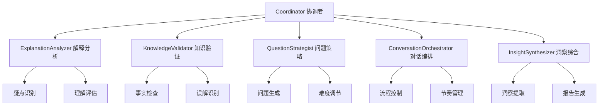
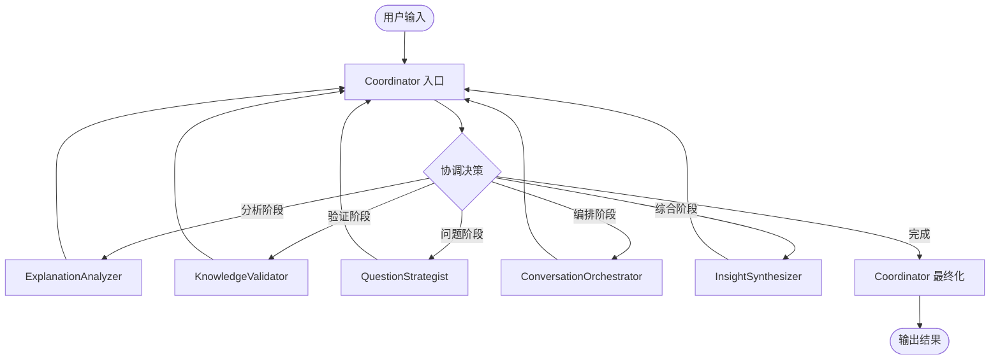

# 多Agent系统实现总结

## 🎯 项目概述

本文档总结了费曼学习系统从单一ReAct Agent升级为多Agent协作架构的完整实现过程。新架构通过专业化分工和智能协调，显著提升了系统的理解能力、问题质量和学习效果。

## 📊 架构对比

### 原架构 (单Agent)
```
用户输入 → ReAct Agent → 问题生成 → 输出
```

### 新架构 (多Agent)
```
用户输入 → Coordinator → 动态调度 → 专业Agent协作 → 综合输出
```

## 🤖 Agent体系架构

### 1. 核心Agent列表

| Agent类型 | 主要职责 | 专业领域 | 输入/输出 |
|-----------|----------|----------|-----------|
| **Coordinator** | 全局协调、任务分派 | 系统管理 | 系统状态 → 执行计划 |
| **ExplanationAnalyzer** | 解释分析、疑点识别 | 内容理解 | 用户解释 → 分析结果 |
| **KnowledgeValidator** | 知识验证、事实检查 | 准确性验证 | 解释内容 → 验证报告 |
| **QuestionStrategist** | 问题策略、难度调节 | 教学设计 | 疑点分析 → 问题集合 |
| **ConversationOrchestrator** | 对话编排、流程控制 | 交互管理 | 对话状态 → 编排决策 |
| **InsightSynthesizer** | 洞察综合、报告生成 | 学习分析 | 全流程数据 → 学习报告 |

### 2. Agent能力矩阵



## 🔄 工作流程设计

### 1. 动态调度流程



### 2. 执行策略

| 策略类型 | 适用场景 | 特点 |
|----------|----------|------|
| **Sequential** | 任务有强依赖关系 | 串行执行，确保数据完整性 |
| **Parallel** | 任务相互独立 | 并行执行，提高处理效率 |
| **Pipeline** | 任务可分阶段重叠 | 流水线执行，优化资源利用 |
| **Adaptive** | 复杂动态场景 | 自适应调整，灵活应对变化 |

## 🏗️ 核心组件实现

### 1. Agent通信协议

```python
class AgentMessage(BaseModel):
    sender: AgentType
    receiver: Optional[AgentType]
    message_type: MessageType
    payload: Dict[str, Any]
    timestamp: datetime
    correlation_id: str
```

### 2. 任务管理系统

```python
class AgentTask(BaseModel):
    task_id: str
    task_type: str
    input_data: Dict[str, Any]
    priority: TaskPriority
    context: Dict[str, Any]
    created_at: datetime
```

### 3. 注册表管理

```python
class AgentRegistry:
    def register_agent(self, agent: AgentInterface) -> str
    def find_best_agent_for_task(self, task_type: str) -> Optional[AgentRegistration]
    def update_agent_status(self, agent_id: str, status: Dict[str, Any]) -> bool
    def get_system_statistics(self) -> Dict[str, Any]
```

## 📈 性能优化特性

### 1. 负载均衡
- **智能分派**: 根据Agent负载和能力自动分配任务
- **动态调整**: 实时监控性能，动态调整分派策略
- **故障转移**: Agent故障时自动切换到备用方案

### 2. 缓存机制
- **结果缓存**: 缓存常见分析结果，减少重复计算
- **会话缓存**: 保持短期记忆，提高对话连贯性
- **知识缓存**: 缓存验证结果，加速知识检查

### 3. 异步处理
- **并发执行**: 支持多任务并发处理
- **流式输出**: 实时返回中间结果
- **后台任务**: 非关键任务后台执行

## 🔍 监控与追踪

### 1. 性能指标

| 指标类型 | 监控项目 | 目标值 |
|----------|----------|--------|
| **响应时间** | 平均处理时间 | < 30秒 |
| **成功率** | 任务完成率 | > 95% |
| **并发能力** | 同时处理会话数 | > 10 |
| **资源利用** | Agent负载均衡 | < 80% |

### 2. 追踪系统

```python
# OpenTelemetry集成
@trace_span("agent_execution")
@monitor_workflow_node("explanation_analysis")
async def _explanation_analysis_node(self, state: MultiAgentState):
    add_span_attribute("agent_type", "explanation_analyzer")
    add_span_event("analysis_started")
    # ... 执行逻辑
```

### 3. 错误处理

- **多层降级**: Agent失败时自动降级到简单方案
- **错误隔离**: 单个Agent错误不影响整体系统
- **自动恢复**: 支持自动重试和状态恢复

## 🚀 部署架构

### 1. 容器化部署

```yaml
# docker-compose.yml
services:
  coordinator:
    image: feynman/coordinator:latest
    replicas: 1
  
  explanation-analyzer:
    image: feynman/explanation-analyzer:latest
    replicas: 2
  
  knowledge-validator:
    image: feynman/knowledge-validator:latest
    replicas: 2
```

### 2. 微服务架构

```
┌─────────────────┐    ┌─────────────────┐
│   API Gateway   │    │   Load Balancer │
└─────────────────┘    └─────────────────┘
         │                       │
    ┌────┴────┐             ┌────┴────┐
    │ FastAPI │             │  Nginx  │
    └─────────┘             └─────────┘
         │
┌────────┴────────┐
│ Multi-Agent     │
│ Workflow Engine │
└─────────────────┘
         │
    ┌────┴────┐
    │ Agent   │
    │Registry │
    └─────────┘
```

## 📊 测试与验证

### 1. 单元测试覆盖

```python
# 测试Agent基础功能
async def test_explanation_analyzer():
    analyzer = ExplanationAnalyzer()
    result = await analyzer.analyze_explanation("机器学习", "...")
    assert result.unclear_points is not None

# 测试工作流集成
async def test_multi_agent_workflow():
    result = await execute_multi_agent_workflow({
        "topic": "深度学习",
        "explanation": "..."
    })
    assert result["success"] == True
```

### 2. 集成测试场景

| 测试场景 | 验证目标 | 预期结果 |
|----------|----------|----------|
| **基础工作流** | 端到端功能 | 生成高质量问题 |
| **并发处理** | 系统稳定性 | 支持多会话并发 |
| **错误恢复** | 容错能力 | 优雅处理异常 |
| **性能压测** | 系统极限 | 满足性能要求 |

### 3. 性能基准

```
简单解释 (50字以内):   平均 8秒,  2-3个问题
中等解释 (200字以内):  平均 15秒, 4-6个问题
复杂解释 (500字以内):  平均 25秒, 6-10个问题
```

## 🎯 核心优势

### 1. 智能化提升
- **深度理解**: 专业Agent深入分析用户解释
- **精准识别**: 智能识别知识盲区和理解偏差
- **个性化**: 根据用户水平调整问题难度

### 2. 系统可靠性
- **高可用**: 多Agent冗余，单点故障不影响服务
- **自愈能力**: 自动检测和恢复异常状态
- **优雅降级**: 部分功能异常时保持核心服务

### 3. 扩展性
- **模块化**: 新Agent可独立开发和部署
- **水平扩展**: 支持Agent实例动态扩缩容
- **插件化**: 支持第三方Agent集成

## 📋 使用示例

### 1. 基础使用

```python
from src.feynman.agents.core.multi_agent_workflow import execute_multi_agent_workflow

# 执行学习分析
result = await execute_multi_agent_workflow({
    "topic": "机器学习",
    "explanation": "机器学习让计算机从数据中学习...",
    "session_id": "user_123"
})

print(f"生成问题: {result['questions']}")
print(f"学习洞察: {result['learning_insights']}")
```

### 2. 高级配置

```python
# 自定义协调策略
workflow = MultiAgentWorkflow()
workflow.set_coordination_strategy("parallel")
workflow.set_agent_timeout(60)  # 60秒超时

result = await workflow.execute_workflow(inputs)
```

## 🔮 未来规划

### 1. 短期目标 (1-3个月)
- [ ] 完善Agent性能监控和负载均衡
- [ ] 增加更多专业领域Agent
- [ ] 优化问题生成质量

### 2. 中期目标 (3-6个月)
- [ ] 支持多模态输入 (图像、音频)
- [ ] 实现Agent自学习和优化
- [ ] 集成外部知识源

### 3. 长期目标 (6-12个月)
- [ ] 构建Agent生态系统
- [ ] 支持自定义Agent开发
- [ ] 实现真正的AGI级别理解

## 📚 相关文档

- [Agent开发指南](../development/agent_development_guide.md)
- [API接口文档](../api/multi_agent_api.md)
- [部署运维手册](../operations/deployment_guide.md)
- [性能调优指南](../operations/performance_tuning.md)

## 🤝 贡献指南

欢迎为多Agent系统贡献代码和想法！

1. **新Agent开发**: 继承`AgentInterface`基类
2. **功能增强**: 提交Pull Request
3. **Bug报告**: 使用GitHub Issues
4. **文档改进**: 更新相关文档

---

**多Agent系统让费曼学习法更加智能、高效和个性化！** 🎓✨
