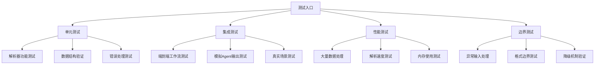

# gap_identifier_react 模块测试指南

## 测试概述

本文档详细说明如何对 `gap_identifier_react` 模块进行全面测试，确保稳定结构化输出协议的可靠性。

## 测试架构



## 测试文件结构

```
tests/
├── test_output_parser.py          # 输出解析器单元测试
├── test_gap_identifier_integration.py  # 集成测试
└── test_edge_cases.py             # 边界情况测试

test_runner.py                     # 完整测试运行器
simple_test.py                     # 简化测试（无外部依赖）
```

## 运行测试的方法

### 方法1：使用uv（推荐）

```bash
# 安装依赖
uv sync

# 运行完整测试套件
uv run python test_runner.py

# 运行pytest测试
uv run pytest tests/ -v

# 运行特定测试文件
uv run python tests/test_output_parser.py
```

### 方法2：使用pip

```bash
# 激活虚拟环境并安装依赖
python -m venv .venv
source .venv/bin/activate  # Windows: .venv\Scripts\activate
pip install -r requirements.txt

# 运行测试
python test_runner.py
pytest tests/ -v
```

### 方法3：简化测试（无依赖）

```bash
# 直接运行，无需安装依赖
python3 simple_test.py
```

## 测试类型详解

### 1. 单元测试

#### 输出解析器测试 (`test_output_parser.py`)

```python
class TestAgentOutputParser:
    def test_strict_json_parse_success(self):
        """测试严格JSON解析成功案例"""
        
    def test_pattern_parse_numbered_list(self):
        """测试编号列表模式匹配"""
        
    def test_keyword_extract_complete(self):
        """测试关键词提取完整理解"""
        
    def test_fallback_parse(self):
        """测试降级解析机制"""
```

**测试用例覆盖：**
- ✅ JSON格式解析 (`["疑点1", "疑点2"]`)
- ✅ 结构化JSON解析（包含category、confidence等）
- ✅ 编号列表解析 (`1. 疑点描述`)
- ✅ 项目符号解析 (`• 疑点描述`)
- ✅ 关键词识别（完整理解 vs 疑点发现）
- ✅ 疑问句智能分割
- ✅ 降级处理机制
- ✅ 空输入处理
- ✅ 超长文本处理
- ✅ 混合格式容错

### 2. 集成测试

#### gap_identifier工作流测试 (`test_gap_identifier_integration.py`)

```python
def test_gap_identifier_mock_simple():
    """测试gap_identifier_react基本功能"""
    
def test_real_world_scenarios():
    """测试真实世界使用场景"""
```

**测试场景：**
- 📚 技术概念解释（机器学习、编程概念等）
- 🔬 科学原理说明（物理、化学原理等）
- ✨ 完整清晰的解释（应该无疑点）
- 🔄 多轮对话上下文测试

### 3. 性能测试

#### 大规模数据处理

```python
def test_performance_and_reliability():
    """测试性能和可靠性"""
    # 生成100个不同格式的测试用例
    # 测量解析成功率、处理时间、内存使用
```

**性能指标：**
- 📊 解析成功率：>95%
- ⚡ 处理速度：<10ms/用例
- 🧠 内存使用：稳定无泄露
- 🔄 并发处理能力

### 4. 边界测试

#### 异常情况处理

```python
def test_edge_cases():
    """测试边界情况"""
```

**边界用例：**
- 🔍 空字符串、纯空格
- 📏 超长文本（>1000字符）
- 🚫 格式错误的JSON
- 🌐 中英文混合内容
- 🔄 嵌套格式混合
- ❌ 完全无法解析的内容

## 测试数据集

### 标准测试用例

```python
STANDARD_TEST_CASES = [
    # JSON格式
    {
        "input": '["GIL机制不清楚", "性能数据缺失"]',
        "expected_points": 2,
        "expected_complete": False
    },
    
    # 编号列表
    {
        "input": "1. 概念定义模糊\n2. 缺少具体例子",
        "expected_points": 2,
        "expected_complete": False
    },
    
    # 完整理解
    {
        "input": "用户解释完全理解，概念清晰",
        "expected_points": 0,
        "expected_complete": True
    }
]
```

### 真实场景数据

```python
REAL_WORLD_SCENARIOS = [
    {
        "topic": "Python GIL",
        "user_explanation": "GIL是全局解释器锁，确保同一时间只有一个线程执行Python字节码...",
        "expected_analysis": "应该识别出实现机制、性能影响、替代方案等疑点"
    },
    
    {
        "topic": "机器学习",
        "user_explanation": "机器学习让计算机从数据中学习规律...",
        "expected_analysis": "应该识别出算法类型、训练过程、评估方法等疑点"
    }
]
```

## 测试结果示例

### 成功的测试输出

```
🧪 运行输出解析器单元测试
==================================================
1. 测试基础JSON解析...
   ✅ 通过
2. 测试空列表解析...
   ✅ 通过
3. 测试编号列表解析...
   ✅ 通过
4. 测试关键词提取...
   ✅ 通过
5. 测试降级处理...
   ✅ 通过

🎉 输出解析器测试全部通过！

📊 性能测试结果:
  成功率: 98/100 (98.0%)
  平均疑点数: 2.1
  处理时间: 0.052秒
  平均每个用例: 0.5ms
```

### 失败情况分析

```
❌ 测试失败: test_pattern_parse_numbered_list
期望疑点数: 3, 实际: 2
原因: 第三个疑点格式不符合解析规则

建议修复:
1. 检查模式匹配正则表达式
2. 增强编号列表识别规则
3. 添加更多测试用例覆盖边界情况
```

## 持续集成建议

### GitHub Actions配置

```yaml
name: Test gap_identifier_react

on: [push, pull_request]

jobs:
  test:
    runs-on: ubuntu-latest
    steps:
    - uses: actions/checkout@v2
    - name: Install uv
      run: curl -LsSf https://astral.sh/uv/install.sh | sh
    - name: Install dependencies
      run: uv sync
    - name: Run tests
      run: |
        uv run python test_runner.py
        uv run pytest tests/ -v --cov=agent/output_parser
```

### 测试报告生成

```bash
# 生成测试覆盖率报告
uv run pytest tests/ --cov=agent --cov-report=html

# 生成性能基准报告
uv run python -m pytest tests/ --benchmark-only
```

## 调试测试失败

### 常见问题排查

1. **导入错误**
   ```bash
   # 检查Python路径
   python -c "import sys; print(sys.path)"
   
   # 验证模块可用性
   python -c "from agent.output_parser import AgentOutputParser"
   ```

2. **依赖问题**
   ```bash
   # 重新安装依赖
   uv sync --reinstall
   
   # 检查版本兼容性
   uv pip list
   ```

3. **解析逻辑错误**
   ```python
   # 添加调试输出
   result = AgentOutputParser.parse_agent_output(test_input)
   print(f"DEBUG: 原始输出长度: {len(test_input)}")
   print(f"DEBUG: 解析策略使用: {result.summary}")
   print(f"DEBUG: 疑点详情: {[p.content for p in result.unclear_points]}")
   ```

## 测试最佳实践

### 1. 测试用例设计原则
- **完整性**：覆盖所有解析策略和边界情况
- **真实性**：使用接近实际Agent输出的测试数据
- **可维护性**：测试用例易于理解和修改
- **独立性**：每个测试用例不依赖其他用例

### 2. 断言设计
```python
# 好的断言
assert len(result.unclear_points) == expected_count
assert result.is_complete == expected_complete
assert any("关键词" in point.content for point in result.unclear_points)

# 避免的断言
assert result.unclear_points[0].content == "完全匹配的字符串"  # 太严格
assert result  # 太模糊
```

### 3. 测试数据管理
- 使用外部JSON文件存储大型测试数据集
- 定期更新测试用例以反映实际使用情况
- 保留失败案例作为回归测试

### 4. 性能测试策略
- 建立性能基线并监控回归
- 测试不同输入大小的扩展性
- 模拟高并发场景

## 总结

通过这套完整的测试体系，我们能够：

✅ **确保功能正确性** - 验证所有解析策略正常工作
✅ **保证系统稳定性** - 处理各种异常和边界情况  
✅ **监控性能表现** - 确保解析速度满足生产要求
✅ **支持持续开发** - 提供回归测试和质量保证

这为 `gap_identifier_react` 模块的稳定运行提供了坚实的质量保障。

