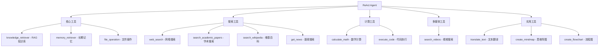

# AI学生Agent工具使用指南

## 工具概述

费曼学习系统现在配备了丰富的API工具，能够帮助AI学生更好地分析、验证和扩展学习内容。

## 工具架构



## 详细工具说明

### 1. 核心工具 (本地/内置)

#### knowledge_retriever
- **功能**: 查询RAG知识库
- **用途**: 检索相关背景知识和权威资料
- **配置**: 需要先运行 `ingest.py` 构建知识库
- **示例**: 查询"机器学习原理"相关资料

#### memory_retriever
- **功能**: 查询长期记忆数据库
- **用途**: 回忆之前的对话内容，避免重复提问
- **配置**: 自动管理，无需额外配置
- **示例**: 查找之前讨论过的Python概念

#### file_operation
- **功能**: 读写文件
- **用途**: 保存学习笔记、读取文档
- **配置**: 无需额外配置
- **示例**: 保存总结到文件

### 2. 搜索工具 (API驱动)

#### web_search (Tavily API)
- **功能**: 网络搜索和网页抓取
- **API**: Tavily Search API
- **配置**: 
  ```bash
  TAVILY_API_KEY="your-tavily-api-key"
  ```
- **获取API**: [Tavily](https://tavily.com/)
- **用途**: 获取最新信息，验证事实
- **示例**: 搜索"Python 3.12新特性"

#### search_academic_papers (arXiv API)
- **功能**: 搜索学术论文
- **API**: arXiv API (免费)
- **配置**: 无需API密钥
- **用途**: 查找权威学术资料
- **示例**: 搜索"deep learning transformer"论文

#### search_wikipedia (Wikipedia API)
- **功能**: 搜索维基百科条目
- **API**: Wikipedia API (免费)
- **配置**: 无需API密钥
- **用途**: 获取概念的权威定义
- **示例**: 查询"量子计算"基础概念

#### get_news (NewsAPI)
- **功能**: 获取最新新闻
- **API**: NewsAPI
- **配置**: 
  ```bash
  NEWS_API_KEY="your-newsapi-key"
  ```
- **获取API**: [NewsAPI](https://newsapi.org/)
- **用途**: 了解相关领域最新动态
- **示例**: 搜索"人工智能"最新新闻

### 3. 计算工具

#### calculate_math (WolframAlpha + Python)
- **功能**: 数学计算和求解
- **API**: WolframAlpha API (可选) + Python内置计算
- **配置**: 
  ```bash
  WOLFRAM_API_KEY="your-wolfram-api-key"  # 可选
  ```
- **获取API**: [WolframAlpha](https://products.wolframalpha.com/api/)
- **降级机制**: 如无API密钥，使用Python内置数学函数
- **用途**: 验证数学计算，求解方程
- **示例**: 计算"sqrt(2) + sin(pi/4)"

#### execute_code (Judge0 API)
- **功能**: 执行多种编程语言代码
- **API**: Judge0 API via RapidAPI
- **配置**: 
  ```bash
  JUDGE0_API_KEY="your-rapidapi-key"
  ```
- **获取API**: [RapidAPI Judge0](https://rapidapi.com/judge0-official/api/judge0-ce/)
- **支持语言**: Python, JavaScript, Java, C++, C, PHP, Ruby, Go, Rust, Swift
- **用途**: 验证编程概念，运行示例代码
- **示例**: 执行Python排序算法

### 4. 多媒体工具

#### search_videos (YouTube Data API)
- **功能**: 搜索教育视频
- **API**: YouTube Data API v3
- **配置**: 
  ```bash
  YOUTUBE_API_KEY="your-youtube-api-key"
  ```
- **获取API**: [Google Cloud Console](https://console.cloud.google.com/)
- **用途**: 查找相关教学视频
- **示例**: 搜索"机器学习入门教程"


### 5. 实用工具

#### translate_text (百度翻译API)
- **功能**: 文本翻译
- **API**: 百度翻译API
- **配置**: 
  ```bash
  BAIDU_TRANSLATE_API_KEY="your-baidu-app-id"
  BAIDU_TRANSLATE_SECRET_KEY="your-baidu-secret-key"
  ```
- **获取API**: [百度翻译开放平台](https://fanyi-api.baidu.com/)
- **支持语言**: 中文、英文、日语、韩语等
- **用途**: 处理多语言学习内容
- **示例**: 将英文论文摘要翻译成中文

#### create_mindmap (多种在线API)
- **功能**: 创建思维导图
- **API**: Mermaid.js + PlantUML + QuickChart
- **配置**: 
  ```bash
  QUICKCHART_API_KEY="your-quickchart-key"  # 可选，用于高级功能
  ```
- **获取API**: [QuickChart](https://quickchart.io/) (可选)
- **支持格式**: Mermaid, PlantUML, QuickChart
- **用途**: 可视化知识结构和概念关系
- **示例**: 创建"机器学习算法分类"思维导图

#### create_flowchart (多种在线API)
- **功能**: 创建流程图
- **API**: Mermaid.js + PlantUML (免费)
- **配置**: 无需额外配置
- **支持格式**: Mermaid, PlantUML
- **用途**: 展示流程、算法或步骤序列
- **示例**: 创建"深度学习模型训练流程"

## API配置指南

### 环境变量配置

在 `environments/test.env` 文件中配置所需的API密钥：

```bash
# ======================
# 第三方API工具配置
# ======================

# Tavily网络搜索
TAVILY_API_KEY="your-tavily-api-key"

# 百度翻译API  
BAIDU_TRANSLATE_API_KEY="your-baidu-app-id"
BAIDU_TRANSLATE_SECRET_KEY="your-baidu-secret-key"

# WolframAlpha数学计算API (可选)
WOLFRAM_API_KEY="your-wolfram-api-key"

# YouTube视频搜索API
YOUTUBE_API_KEY="your-youtube-api-key"

# 新闻搜索API
NEWS_API_KEY="your-newsapi-key"

# Judge0代码执行API
JUDGE0_API_KEY="your-rapidapi-key"

# QuickChart图表生成API (可选)
QUICKCHART_API_KEY="your-quickchart-key"
```

### API申请指南

#### 1. Tavily API
1. 访问 [Tavily](https://tavily.com/)
2. 注册账号并创建API密钥
3. 免费版每月1000次请求

#### 2. 百度翻译API
1. 访问 [百度翻译开放平台](https://fanyi-api.baidu.com/)
2. 注册百度账号并实名认证
3. 创建应用获取APP ID和密钥
4. 免费版每月200万字符

#### 3. WolframAlpha API
1. 访问 [WolframAlpha Developer Portal](https://products.wolframalpha.com/api/)
2. 注册账号并申请API密钥
3. 免费版每月2000次查询

#### 4. YouTube Data API
1. 访问 [Google Cloud Console](https://console.cloud.google.com/)
2. 创建项目并启用YouTube Data API v3
3. 创建API密钥
4. 免费版每天100万单位配额

#### 5. NewsAPI
1. 访问 [NewsAPI](https://newsapi.org/)
2. 注册账号获取API密钥
3. 免费版每月1000次请求

#### 6. Judge0 API
1. 访问 [RapidAPI](https://rapidapi.com/)
2. 注册账号并订阅Judge0 CE API
3. 获取RapidAPI密钥
4. 免费版每月100次执行

#### 7. QuickChart API (可选)
1. 访问 [QuickChart](https://quickchart.io/)
2. 注册账号获取API密钥
3. 免费版每月500次请求
4. 用于高级思维导图功能

## 工具使用最佳实践

### 1. 工具选择策略
- **优先级**: 免费API > 付费API > 本地工具
- **可靠性**: 本地工具 > 免费API > 付费API
- **准确性**: 权威API (Wikipedia, arXiv) > 通用搜索

### 2. 错误处理
- 所有工具都有完善的错误处理机制
- API不可用时会返回友好的错误信息
- 部分工具有降级方案 (如计算工具)

### 3. 性能优化
- 设置合理的超时时间
- 缓存频繁查询的结果
- 避免重复调用相同API

### 4. 成本控制
- 监控API使用量
- 设置使用限制
- 优先使用免费API

## 工具测试

使用以下命令测试工具功能：

```bash
# 运行工具测试脚本
python3 test_tools.py

# 或使用uv
uv run python test_tools.py
```

## 故障排除

### 常见问题

1. **API密钥错误**
   - 检查环境变量配置
   - 验证API密钥有效性
   - 确认API额度未用完

2. **网络连接问题**
   - 检查网络连接
   - 确认防火墙设置
   - 尝试使用代理

3. **返回结果为空**
   - 调整搜索查询词
   - 检查API服务状态
   - 尝试其他工具

### 调试技巧

1. **启用详细日志**
   ```bash
   LOG_LEVEL=DEBUG python3 main.py
   ```

2. **单独测试工具**
   ```python
   from agent.tools import search_wikipedia
   result = search_wikipedia("机器学习")
   print(result)
   ```

3. **检查API响应**
   - 使用Postman等工具直接测试API
   - 查看API文档确认请求格式

## 扩展开发

### 添加新工具

1. **在 `agent/tools.py` 中定义工具**
   ```python
   @tool
   def new_api_tool(query: str) -> str:
       """新API工具描述"""
       # 实现逻辑
       return result
   ```

2. **在 `agent/agent.py` 中注册工具**
   ```python
   from .tools import new_api_tool
   tools = [existing_tools..., new_api_tool]
   ```

3. **添加环境变量配置**
   ```bash
   NEW_API_KEY="your-api-key"
   ```

### 工具优化建议

1. **添加缓存机制**
2. **实现重试逻辑**
3. **支持批量操作**
4. **增加结果过滤**
5. **提供更多配置选项**

通过这套完整的工具体系，AI学生Agent能够：
- 🔍 多维度搜索和验证信息
- 🧮 执行复杂的数学和编程计算
- 🌐 获取最新的知识和动态
- 📚 查找权威的学术资料
- 🎬 发现相关的教育视频
- 🌍 处理多语言学习内容
- 📊 创建思维导图和流程图，可视化知识结构

这为费曼学习系统提供了强大的知识获取、验证和可视化能力。

## 思维导图工具详细说明

### create_mindmap 工具

#### 功能特性
- **多格式支持**: Mermaid、PlantUML、QuickChart
- **在线渲染**: 生成可直接访问的在线链接
- **图片导出**: 支持PNG格式图片输出
- **层级结构**: 支持多层级思维导图

#### 使用示例

```python
# 创建机器学习思维导图
result = create_mindmap(
    topic="机器学习算法",
    content="""
    - 监督学习
      - 分类算法
        - 决策树
        - 随机森林
        - SVM
      - 回归算法
        - 线性回归
        - 多项式回归
    - 无监督学习
      - 聚类算法
        - K-means
        - 层次聚类
      - 降维算法
        - PCA
        - t-SNE
    """,
    style="mermaid"
)
```

#### 输出格式

工具会返回：
1. **Mermaid代码**: 可以复制到支持的编辑器
2. **在线链接**: 直接在浏览器中查看和编辑
3. **图片链接**: 可嵌入文档或演示文稿

### create_flowchart 工具

#### 功能特性
- **流程可视化**: 清晰展示步骤和决策点
- **条件分支**: 自动识别条件语句
- **多种样式**: Mermaid和PlantUML格式
- **免费使用**: 无需API密钥

#### 使用示例

```python
# 创建深度学习训练流程图
result = create_flowchart(
    title="深度学习模型训练流程",
    steps="""
    - 数据预处理
    - 数据是否充足？
    - 数据增强
    - 模型设计
    - 模型训练
    - 验证集评估
    - 性能是否满足要求？
    - 模型优化
    - 模型部署
    """,
    style="mermaid"
)
```

### 最佳实践

#### 1. 思维导图内容组织
- **层级清晰**: 使用缩进表示层级关系
- **内容简洁**: 每个节点包含核心概念
- **逻辑顺序**: 按重要性或逻辑顺序排列

#### 2. 流程图设计原则
- **步骤明确**: 每个步骤描述清晰具体
- **决策点标记**: 用问号标记判断条件
- **流向合理**: 确保流程逻辑正确

#### 3. 格式选择建议
- **Mermaid**: 现代化外观，支持在线编辑
- **PlantUML**: 丰富的图表类型，专业外观
- **QuickChart**: 网络图风格，适合复杂关系

### 集成到学习流程

思维导图和流程图工具可以在以下场景中发挥重要作用：

1. **概念整理**: 将复杂概念结构化展示
2. **知识梳理**: 梳理学习要点和知识体系
3. **流程说明**: 解释算法、流程或方法步骤
4. **问题分析**: 分解复杂问题的解决思路
5. **学习计划**: 制定结构化的学习路径
