# 🎓 费曼学习系统 - 项目结构完整解析

## 📋 目录

1. [系统概述](#系统概述)
2. [整体架构](#整体架构)
3. [核心模块详解](#核心模块详解)
4. [工作流程](#工作流程)
5. [技术栈](#技术栈)
6. [部署方案](#部署方案)
7. [使用指南](#使用指南)
8. [项目统计](#项目统计)

---

## 📊 系统概述

费曼学习系统是一个基于**LangGraph + FastAPI + Streamlit**的智能学习助手，采用**微服务化模块设计**，支持多模态学习、知识图谱构建和全面监控。

### 🏆 核心创新点

- **💡 反转教学模式**：AI当学生，人类当老师
- **⚡ 流式实时对话**：LangGraph状态机式对话管理
- **🕸️ 动态知识图谱**：实时构建概念关系网络
- **🛠️ 丰富工具生态**：13个专业AI工具无缝集成
- **💰 智能成本控制**：自动追踪API使用成本
- **📊 全方位监控**：性能+健康+成本+追踪体系

### 🎯 适用场景

- 🏫 **教育培训**：个性化教学助手
- 🏢 **企业培训**：员工技能提升
- 🧠 **知识管理**：组织知识库构建
- 🔬 **研究辅助**：文献整理和概念梳理

---

## 🏗️ 整体架构

### 系统架构图

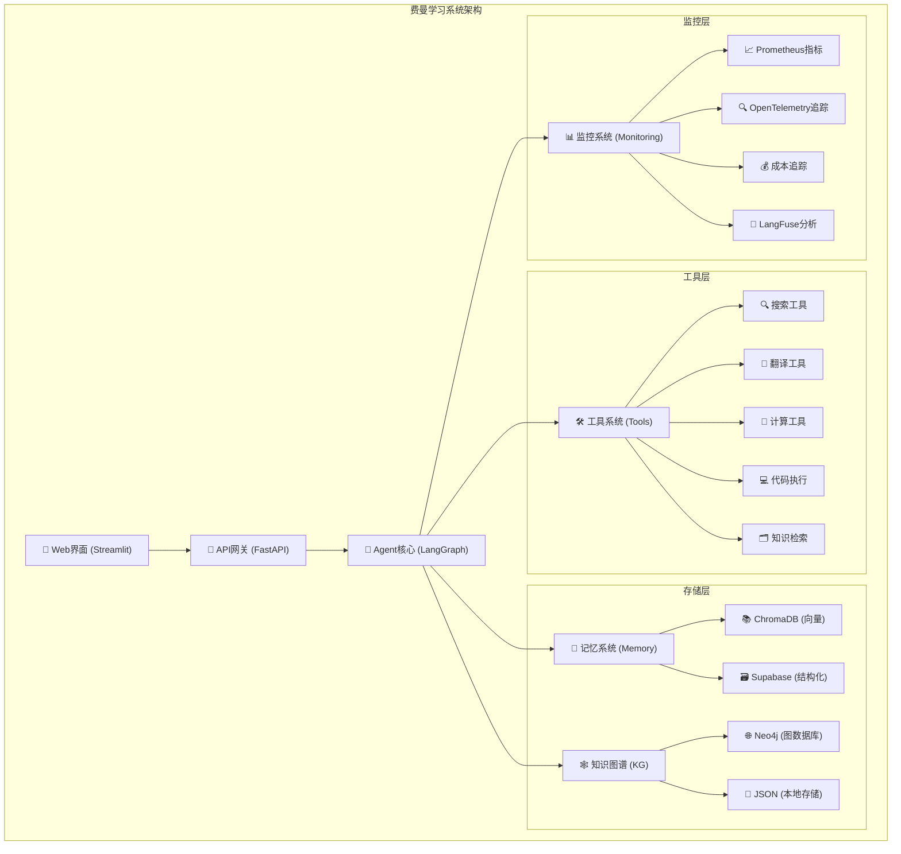

### 核心模块架构

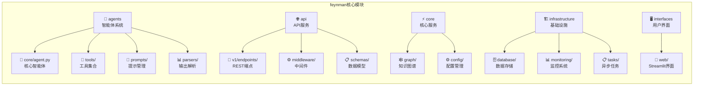

---

## 🔧 核心模块详解

### 📁 目录结构概览

```
src/feynman/
├── agents/                 # 🤖 智能体系统
│   ├── core/              # 核心Agent实现
│   ├── tools/             # 13个AI工具
│   ├── prompts/           # 提示词管理系统
│   └── parsers/           # 输出解析器
├── api/                   # 🌐 API服务层
│   ├── v1/endpoints/      # REST API端点
│   ├── middleware/        # 中间件 (监控/CORS)
│   └── schemas/           # 数据模型
├── core/                  # ⚡ 核心服务
│   ├── graph/             # 知识图谱系统
│   └── config/            # 配置管理
├── infrastructure/        # 🏗️ 基础设施
│   ├── database/          # 数据存储
│   ├── monitoring/        # 监控体系
│   └── tasks/             # 异步任务
└── interfaces/            # 🖥️ 用户界面
    └── web/               # Streamlit Web界面
```

### 🤖 智能体系统 (agents/)

#### 🧠 核心Agent (core/agent.py)

```python
# 基于LangGraph的智能对话代理
class FeynmanAgent:
    - 状态管理 (ConversationState)
    - 工作流定义 (StateGraph) 
    - 用户输入处理 (user_input_handler)
    - 记忆整理 (summarize_conversation_for_memory)
    - 多模型支持 (OpenAI + 智谱AI)
```

**工作流程**：
```
用户输入 → 理解分析 → 工具调用 → 记忆存储 → 生成回复
```

#### 🛠️ 工具系统 (tools/tools.py)

**13个专业AI工具分类**：

```python
# 1. 🔍 知识检索类 (3个)
- knowledge_retriever()    # RAG向量搜索
- memory_retriever()       # 长期记忆检索  
- file_operation()         # 文件读写操作

# 2. 🌐 网络搜索类 (3个)
- web_search()            # Tavily网络搜索
- search_academic_papers() # arXiv学术论文
- search_wikipedia()       # 维基百科检索

# 3. 💻 处理计算类 (3个)
- translate_text()         # 百度翻译API
- calculate_math()         # WolframAlpha数学
- execute_code()          # Judge0代码执行

# 4. 🎨 可视化类 (2个)  
- create_mindmap()        # 思维导图生成
- create_flowchart()      # 流程图生成

# 5. 🕸️ 知识图谱类 (2个)
- graph_query()           # 图谱查询
- graph_explain()         # 实体解释
```

#### 📝 提示词管理系统 (prompts/)

```python
📝 prompts/
├── prompt_manager.py     # 统一管理器，缓存+模板渲染
├── agent_prompts.py      # Agent行为提示词
├── system_prompts.py     # 系统级提示词  
├── tool_prompts.py       # 工具相关提示词
└── templates/            # 模板文件
    ├── agent.py          # Agent模板
    ├── system.py         # 系统模板
    └── tools.py          # 工具模板
```

### 🌐 API服务层 (api/)

```python
📡 api/
├── v1/endpoints/              # REST API端点
│   ├── chat.py               # 💬 对话接口 (/chat, /chat/stream)
│   ├── monitoring.py         # 📊 监控接口 (/metrics, /health)  
│   ├── config.py             # ⚙️ 配置接口 (/config/*)
│   └── knowledge_graph.py    # 🕸️ 知识图谱接口 (/kg/*)
├── middleware/               # 中间件层
│   ├── monitoring.py         # 📊 请求监控+指标收集
│   └── cors.py              # 🔒 跨域处理
└── schemas/                 # 数据模型
    └── requests.py          # 📋 请求/响应模型
```

**核心API端点**：
- `POST /chat` - 同步对话  
- `POST /chat/stream` - 流式对话
- `GET /health` - 健康检查
- `GET /metrics` - Prometheus指标
- `GET /kg/*` - 知识图谱查询

### 🕸️ 知识图谱系统 (core/graph/)

```python
🕸️ core/graph/
├── service.py      # 🎯 服务层 - 统一API接口
├── extractor.py    # 🧠 抽取器 - LLM实体关系抽取
├── builder.py      # 🔨 构建器 - 图谱构建逻辑  
├── storage.py      # 💾 存储层 - Neo4j/JSON后端
├── schema.py       # 📋 数据模型 - Pydantic模型
└── __init__.py     # 📦 模块导出
```

**知识图谱工作流程**：
```
文本输入 → LLM抽取 → 三元组 → 图存储 → 查询检索
    ↓         ↓        ↓       ↓        ↓
  原始文档   实体关系   (s,p,o)  Neo4j   可视化
```

### 🏗️ 基础设施层 (infrastructure/)

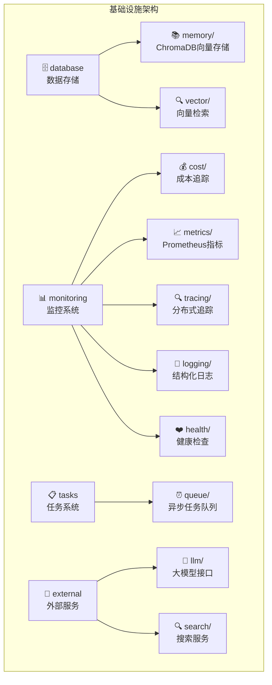

#### 📊 监控系统详解

```python
📊 monitoring/ - 全面监控系统
├── cost/tracker.py          # 💰 成本追踪
│   ├── 模型定价表 (OpenAI + 智谱AI)
│   ├── Token使用统计
│   ├── 预算控制 (日/月限额)
│   └── 同步/异步兼容保存
├── metrics/prometheus.py    # 📈 Prometheus指标
├── tracing/                 # 🔍 分布式追踪  
│   ├── otlp.py             # OpenTelemetry
│   └── langfuse.py         # LangFuse (3.x兼容)
├── logging/structured.py   # 📝 结构化日志
└── health/checker.py       # ❤️ 健康检查
    ├── 系统资源监控
    ├── 数据库连接检查
    ├── API服务状态
    └── 外部依赖验证
```

### 🖥️ 用户界面层 (interfaces/)

```python
🖥️ interfaces/web/
├── streamlit_ui.py          # 🎯 主界面应用
│   ├── 多标签布局 (对话/知识图谱)
│   ├── 实时流式对话
│   ├── 会话状态管理
│   └── 错误处理机制
├── knowledge_graph_ui.py    # 🕸️ 知识图谱可视化
│   ├── 图谱数据展示
│   ├── 交互式查询界面
│   └── 可视化组件
└── streamlit_app.py         # 🚀 应用启动器
```

---

## 🔄 核心工作流程

### 系统工作流程图

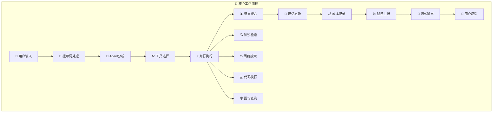

### 数据流架构

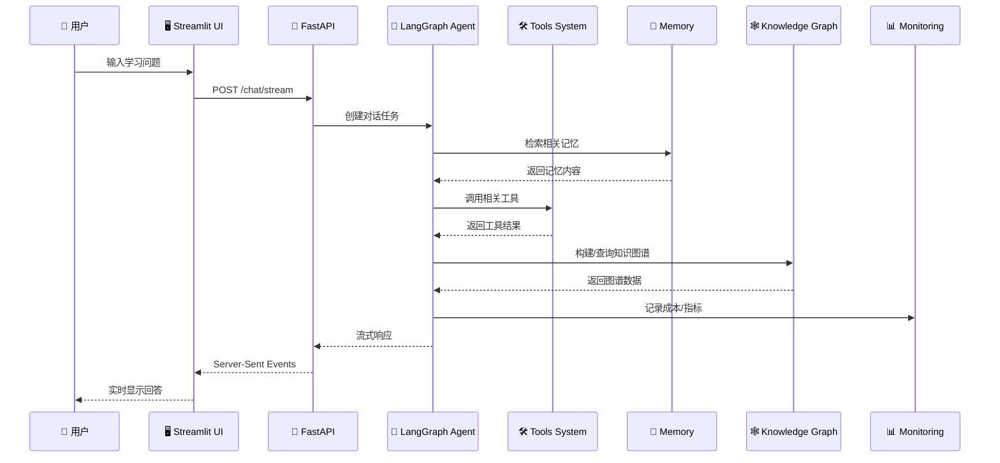

### 实际使用场景流程

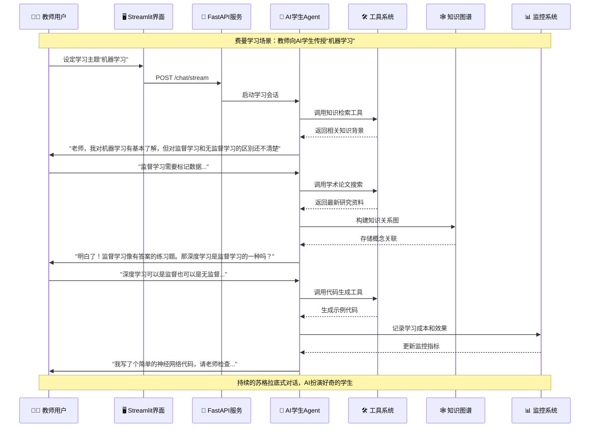

---

## 🚀 技术栈

### 完整技术架构

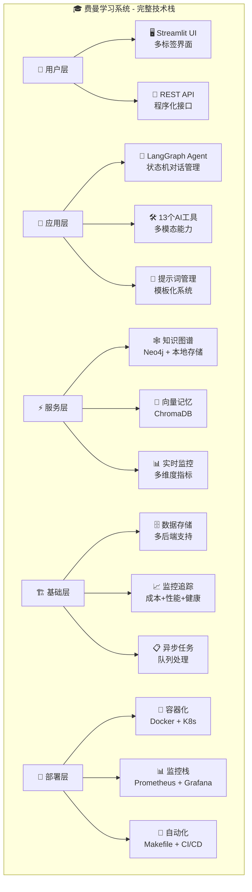

### 核心技术选型

| 技术分类 | 技术选择 | 说明 |
|---------|---------|------|
| **后端框架** | FastAPI + LangGraph | 高性能API + 智能体工作流 |
| **前端界面** | Streamlit | 快速数据应用开发 |
| **AI模型** | OpenAI + 智谱AI | 多模型支持，降低依赖风险 |
| **数据存储** | Neo4j + ChromaDB + Supabase | 图数据库 + 向量存储 + 结构化存储 |
| **监控体系** | Prometheus + Grafana + LangFuse + OpenTelemetry | 全方位监控追踪 |
| **部署方案** | Docker + Kubernetes | 容器化 + 编排 |
| **包管理** | uv | 现代Python依赖管理 |

---

## 🚀 部署方案

### 多环境部署架构

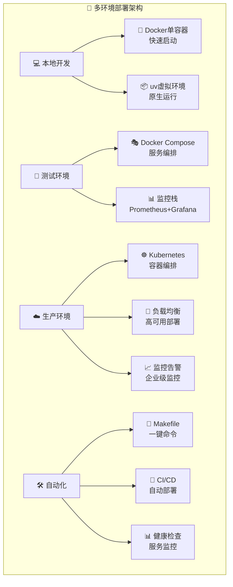

### 配置管理体系

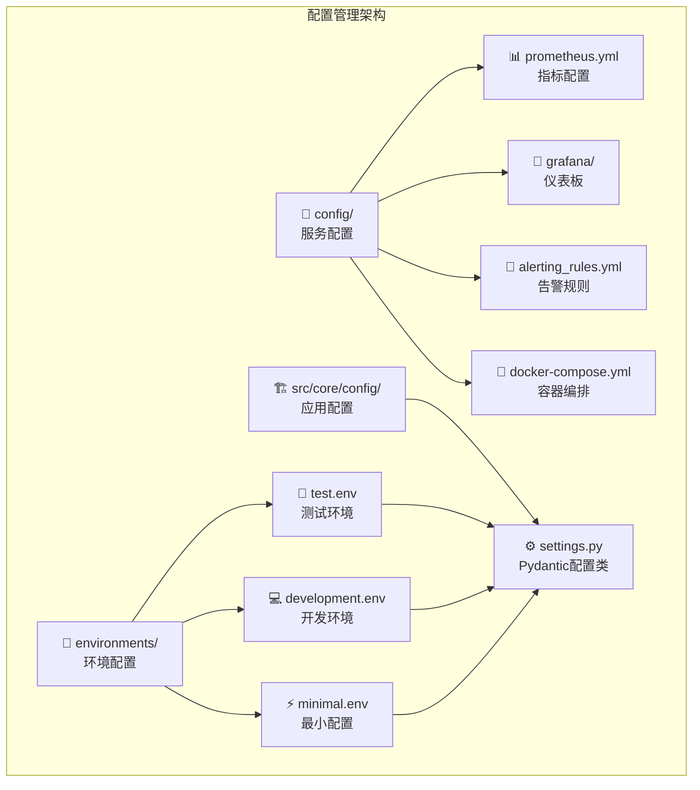

### 容器化配置

**Dockerfile**:
```dockerfile
# 费曼学习系统 Docker配置
FROM python:3.11-slim

WORKDIR /app

# 安装系统依赖
RUN apt-get update && apt-get install -y \
    gcc \
    && rm -rf /var/lib/apt/lists/*

# 复制依赖文件
COPY requirements.txt .
RUN pip install -r requirements.txt

# 复制源代码
COPY src/ ./src/
COPY config/ ./config/
COPY data/ ./data/

# 暴露端口
EXPOSE 8000

# 启动命令
CMD ["python", "-m", "uvicorn", "src.main:app", "--host", "0.0.0.0", "--port", "8000"]
```

---

## 🧪 测试体系

### 测试金字塔

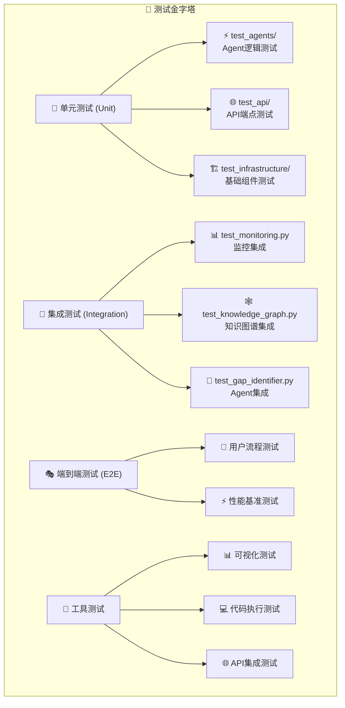

### 测试结构

```python
tests/ - 完整测试金字塔
├── unit/                    # 🔬 单元测试
│   ├── test_agents/        # Agent核心逻辑
│   ├── test_api/           # API端点功能
│   └── test_infrastructure/ # 基础组件
├── integration/            # 🔗 集成测试
│   ├── test_monitoring.py  # 监控系统集成
│   └── test_monitoring_integration.py # 监控完整流程
├── e2e/                   # 🎭 端到端测试
├── fixtures/              # 📋 测试数据
└── 专项测试文件
    ├── test_knowledge_graph.py     # 知识图谱功能
    ├── test_output_parser.py       # 输出解析器
    └── test_api.py                 # API综合测试
```

---

## 🔧 脚本工具生态

### 工具分类架构

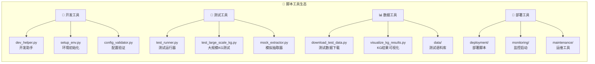

### 工具详解

```python
scripts/ - 完整工具生态
├── 🚀 开发辅助
│   ├── dev_helper.py        # 一键开发检查
│   ├── setup_env.py         # 环境初始化脚本
│   └── config_validator.py  # 配置文件验证
├── 🧪 测试专用
│   ├── test_runner.py       # 独立测试运行器
│   ├── mock_extractor.py    # LLM模拟器(无API调用)
│   └── test_large_scale_kg.py # 大规模知识图谱性能测试
├── 📊 数据管理
│   ├── download_test_data.py    # 自动下载测试语料
│   ├── visualize_kg_results.py # 知识图谱结果可视化
│   └── data/test_corpus/       # 13个领域的测试文档
└── 🚀 运维部署
    ├── deployment/docker/      # Docker容器化
    ├── deployment/k8s/         # Kubernetes编排
    └── monitoring/             # 监控服务启动
```

---

## 📚 文档体系

### 文档架构

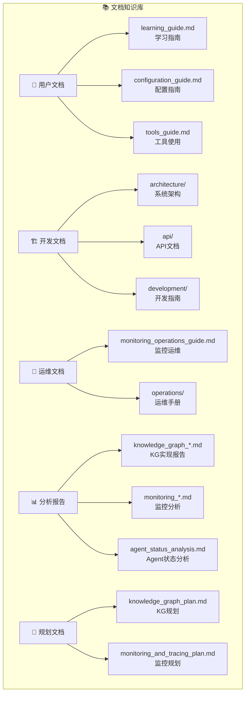

### 文档体系详解

```python
docs/ - 完整知识库 (20个文档)
├── 📖 用户文档
│   ├── learning_guide.md           # 🎓 学习价值分析
│   ├── configuration_guide.md     # ⚙️ 配置详解
│   └── tools_guide.md             # 🛠️ 工具使用指南
├── 🏗️ 开发文档
│   ├── architecture/              # 系统架构设计
│   ├── api/                       # API文档规范
│   ├── development/               # 开发环境指南
│   └── testing_guide.md           # 测试策略
├── 📊 实现报告
│   ├── knowledge_graph_*.md       # 知识图谱实现详解
│   ├── monitoring_*.md            # 监控系统分析
│   └── prompt_management_*.md     # 提示词管理方案
└── 🎯 规划文档
    ├── 各种_plan.md               # 功能规划设计
    └── gap_identifier_*.md        # 功能缺陷分析
```

---

## 🎯 使用指南

### 🚀 快速启动

#### 环境准备

```bash
# 1. 克隆项目
git clone <项目地址>
cd ai_student_agent

# 2. 安装依赖 (推荐使用uv)
uv sync

# 3. 配置环境变量
cp environments/test.env environments/local.env
# 编辑 local.env，设置必需的API密钥
```

#### 一键启动

```bash
# 🚀 开发环境一键启动
make dev-start

# 或分步启动
uv run python src/main.py                              # API服务器
uv run streamlit run src/feynman/interfaces/web/streamlit_ui.py  # Web界面
```

#### 访问地址

- **💻 Web界面**: http://localhost:8501
- **📡 API文档**: http://127.0.0.1:8000/docs
- **📊 健康检查**: http://127.0.0.1:8000/health

### ⚙️ 配置管理

#### 核心配置项

```env
# 必需配置
OPENAI_API_KEY="sk-..."          # OpenAI API密钥
ZHIPU_API_KEY="..."              # 智谱AI API密钥 (备选)
TAVILY_API_KEY="..."             # 网络搜索API

# 知识图谱配置
KG_BACKEND=local                 # 图存储后端 (local/neo4j)
KG_STORAGE_PATH=data/knowledge_graph.json
KG_MAX_NODES=1000
KG_MAX_EDGES=5000

# 监控配置
MONITORING_ENABLED=true
COST_TRACKING_ENABLED=true
DAILY_COST_LIMIT_USD=100
```

#### 工具API配置

```env
# 可选工具API
BAIDU_TRANSLATE_API_KEY=""       # 翻译服务
JUDGE0_API_KEY=""                # 代码执行
WOLFRAM_API_KEY=""               # 数学计算
QUICKCHART_API_KEY=""            # 图表生成
```

### 🛠️ 开发指南

#### 常用命令

```bash
# 开发辅助
make help                        # 查看所有可用命令
make install                     # 安装依赖
make config-check               # 配置验证
make test                       # 运行测试

# 服务启动
make run                        # 启动API服务器
make run-ui                     # 启动Web界面
make dev-start                  # 开发环境完整启动

# 工具脚本
python scripts/dev_helper.py    # 开发检查工具
python scripts/config_validator.py  # 配置验证
python scripts/test_runner.py   # 独立测试运行器
```

#### 添加新工具

1. 在 `src/feynman/agents/tools/tools.py` 中添加工具函数
2. 使用 `@tool` 装饰器标注
3. 在 `src/feynman/agents/tools/__init__.py` 中注册
4. 更新文档和测试

---

## 📊 项目统计

### 📈 代码规模统计

| 指标 | 数量 | 说明 |
|------|------|------|
| **Python文件** | 60个 | 核心业务代码 |
| **代码行数** | 11,665行 | 不含注释和空行 |
| **测试文件** | 10个 | 完整测试覆盖 |
| **配置文件** | 138个 | 多环境配置支持 |
| **文档文件** | 20个 | 完整技术文档 |

### 🎯 功能模块统计

| 模块类别 | 数量 | 详细说明 |
|---------|------|----------|
| **核心模块** | 5个 | agents/api/core/infrastructure/interfaces |
| **AI工具** | 13个 | 搜索/计算/可视化/知识图谱工具 |
| **API端点** | 4个 | 对话/监控/配置/知识图谱服务 |
| **监控维度** | 6个 | 成本/性能/健康/追踪/指标/日志 |
| **存储后端** | 3个 | Neo4j/ChromaDB/Supabase |

### 🚀 技术栈深度

| 技术分类 | 技术选择 | 成熟度 |
|---------|---------|--------|
| **后端框架** | FastAPI + LangGraph | ⭐⭐⭐⭐⭐ |
| **前端界面** | Streamlit | ⭐⭐⭐⭐⭐ |
| **AI模型** | OpenAI + 智谱AI | ⭐⭐⭐⭐⭐ |
| **数据存储** | Neo4j + ChromaDB + Supabase | ⭐⭐⭐⭐ |
| **监控体系** | Prometheus + Grafana + LangFuse + OpenTelemetry | ⭐⭐⭐⭐ |
| **部署方案** | Docker + Kubernetes | ⭐⭐⭐⭐⭐ |
| **包管理** | uv (现代Python) | ⭐⭐⭐⭐⭐ |

---

## 🎊 总结

### 🏆 项目核心价值

**费曼学习系统**是一个技术含量极高、实用价值突出的现代AI教学系统，具有以下特色：

#### 🔥 技术创新点

- ✨ **反转教学理念**：AI扮演学生，激发教学思考
- ⚡ **流式实时交互**：LangGraph状态机，丝滑体验
- 🕸️ **动态知识图谱**：实时构建概念关系网络
- 💰 **智能成本控制**：自动追踪LLM调用成本
- 📊 **全方位监控**：性能+健康+成本+追踪
- 🛠️ **丰富工具生态**：搜索+计算+代码+可视化

#### 🎓 学习价值

- 📊 **企业级架构设计**：微服务+监控+部署
- 🤖 **前沿AI技术**：大模型应用+知识图谱
- 🔧 **工程最佳实践**：测试驱动+文档完整
- 📈 **全栈技能**：后端+前端+运维+AI

#### 💡 适用场景

- 🏫 **教育培训**：个性化教学助手
- 🏢 **企业培训**：员工技能提升
- 🧠 **知识管理**：组织知识库构建
- 🔬 **研究辅助**：文献整理和概念梳理

#### 🎯 适合人群

- 👨‍💻 **Python全栈开发者** - 学习企业架构设计
- 🤖 **AI工程师** - 掌握大模型应用开发
- 👨‍🏫 **教育工作者** - 探索AI辅助教学
- 🏢 **企业技术团队** - 参考微服务架构

### 🚀 立即开始

```bash
# 一键启动完整开发环境
make dev-start

# 访问Web界面
http://localhost:8501

# 开始费曼学习之旅！
```

---

## 📝 结语

**💎 这是一个值得深入学习和实际应用的高质量AI项目！**

费曼学习系统不仅是一个功能完整的AI应用，更是一个技术学习的宝库。从现代Python开发实践到前沿AI技术应用，从微服务架构设计到企业级运维监控，这个项目涵盖了AI工程师和全栈开发者需要掌握的核心技能。

无论你是想学习AI应用开发、企业级架构设计，还是探索教育技术创新，这个项目都能为你提供宝贵的实践经验和技术参考。

**🎓 开始你的费曼学习之旅，让AI成为你最好的学生！**

---

> 📅 **文档更新时间**: 2024年8月  
> 🔖 **版本**: v3.2  
> 📧 **技术支持**: 查看项目 GitHub Issues  
> 📚 **更多文档**: 请参考 `docs/` 目录下的详细文档
